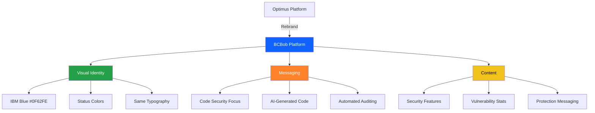

**User:**

<task>
Can you rebrand this whole web app?

It should look similar to this, you can use this codebase for you to copy:
https://github.com/cytojen/bcbob-ibm-bob-hackathon
</task>
<environment_details>
# VSCode Visible Files


# VSCode Open Tabs


# Current Time
Current time in ISO 8601 UTC format: 2026-05-16T15:30:34.768Z
User time zone: Asia/Manila, UTC+8:00

# Current Cost
$0.00

# Review Exclusions
The following file patterns are excluded from code reviews:
- .vscode/**

# Current Mode
<slug>plan</slug>
<name>📝 Plan</name>


# Current Workspace Directory (c:/Users/oxyje/Downloads/IBMhack) Files
.gitignore
components.json
next.config.mjs
package.json
pnpm-lock.yaml
postcss.config.mjs
tsconfig.json
app/
app/globals.css
app/layout.tsx
app/page.tsx
components/
components/theme-provider.tsx
components/landing/
components/landing/animated-sphere.tsx
components/landing/animated-tetrahedron.tsx
components/landing/animated-wave.tsx
components/landing/cta-section.tsx
components/landing/developers-section.tsx
components/landing/features-section.tsx
components/landing/footer-section.tsx
components/landing/hero-section.tsx
components/landing/how-it-works-section.tsx
components/landing/infrastructure-section.tsx
components/landing/integrations-section.tsx
components/landing/metrics-section.tsx
components/landing/navigation.tsx
components/landing/pricing-section.tsx
components/landing/security-section.tsx
components/landing/testimonials-section.tsx
components/ui/
components/ui/accordion.tsx
components/ui/alert-dialog.tsx
components/ui/alert.tsx
components/ui/aspect-ratio.tsx
components/ui/avatar.tsx
components/ui/badge.tsx
components/ui/breadcrumb.tsx
components/ui/button-group.tsx
components/ui/button.tsx
components/ui/calendar.tsx
components/ui/card.tsx
components/ui/carousel.tsx
components/ui/chart.tsx
components/ui/checkbox.tsx
components/ui/collapsible.tsx
components/ui/command.tsx
components/ui/context-menu.tsx
components/ui/dialog.tsx
components/ui/drawer.tsx
components/ui/dropdown-menu.tsx
components/ui/empty.tsx
components/ui/field.tsx
components/ui/form.tsx
components/ui/hover-card.tsx
components/ui/input-group.tsx
components/ui/input-otp.tsx
components/ui/input.tsx
components/ui/item.tsx
components/ui/kbd.tsx
components/ui/label.tsx
components/ui/menubar.tsx
components/ui/navigation-menu.tsx
components/ui/pagination.tsx
components/ui/popover.tsx
components/ui/progress.tsx
components/ui/radio-group.tsx
components/ui/resizable.tsx
components/ui/scroll-area.tsx
components/ui/select.tsx
components/ui/separator.tsx
components/ui/sheet.tsx
components/ui/sidebar.tsx
components/ui/skeleton.tsx
components/ui/slider.tsx
components/ui/sonner.tsx
components/ui/spinner.tsx
components/ui/switch.tsx
components/ui/table.tsx
components/ui/tabs.tsx
components/ui/textarea.tsx
components/ui/toast.tsx
components/ui/toaster.tsx
components/ui/toggle-group.tsx
components/ui/toggle.tsx
components/ui/tooltip.tsx
components/ui/use-mobile.tsx
components/ui/use-toast.ts
hooks/
hooks/use-mobile.ts
hooks/use-toast.ts
lib/
lib/utils.ts
public/
public/apple-icon.png
public/icon-dark-32x32.png
public/icon-light-32x32.png
public/icon.svg
public/placeholder-logo.png
public/placeholder-logo.svg
public/placeholder-user.jpg
public/placeholder.jpg
public/placeholder.svg
styles/
styles/globals.css
You have not created a todo list yet. Create one with `update_todo_list` if your task is complicated or involves multiple steps.
</environment_details>

---

**Assistant:**

I'll help you rebrand this web app by analyzing the reference codebase and creating a comprehensive plan. Let me start by gathering information about both codebases.

<read_file>
<args>
  <file>
    <path>app/page.tsx</path>
  </file>
  <file>
    <path>app/layout.tsx</path>
  </file>
  <file>
    <path>app/globals.css</path>
  </file>
  <file>
    <path>package.json</path>
  </file>
</args>
</read_file>

---

**User:**

[read_file for 4 files] Result:
<files>
<file><path>app/page.tsx</path>
<content lines="1-33">
 1 | import { Navigation } from "@/components/landing/navigation";
 2 | import { HeroSection } from "@/components/landing/hero-section";
 3 | import { FeaturesSection } from "@/components/landing/features-section";
 4 | import { HowItWorksSection } from "@/components/landing/how-it-works-section";
 5 | import { InfrastructureSection } from "@/components/landing/infrastructure-section";
 6 | import { MetricsSection } from "@/components/landing/metrics-section";
 7 | import { IntegrationsSection } from "@/components/landing/integrations-section";
 8 | import { SecuritySection } from "@/components/landing/security-section";
 9 | import { DevelopersSection } from "@/components/landing/developers-section";
10 | import { TestimonialsSection } from "@/components/landing/testimonials-section";
11 | import { PricingSection } from "@/components/landing/pricing-section";
12 | import { CtaSection } from "@/components/landing/cta-section";
13 | import { FooterSection } from "@/components/landing/footer-section";
14 | 
15 | export default function Home() {
16 |   return (
17 |     <main className="relative min-h-screen overflow-x-hidden noise-overlay">
18 |       <Navigation />
19 |       <HeroSection />
20 |       <FeaturesSection />
21 |       <HowItWorksSection />
22 |       <InfrastructureSection />
23 |       <MetricsSection />
24 |       <IntegrationsSection />
25 |       <SecuritySection />
26 |       <DevelopersSection />
27 |       <TestimonialsSection />
28 |       <PricingSection />
29 |       <CtaSection />
30 |       <FooterSection />
31 |     </main>
32 |   );
33 | }
</content>
</file>
<file><path>app/layout.tsx</path>
<content lines="1-42">
 1 | import React from "react"
 2 | import type { Metadata } from 'next'
 3 | import { Instrument_Sans, Instrument_Serif, JetBrains_Mono } from 'next/font/google'
 4 | import { Analytics } from '@vercel/analytics/next'
 5 | import './globals.css'
 6 | 
 7 | const instrumentSans = Instrument_Sans({ 
 8 |   subsets: ["latin"],
 9 |   variable: '--font-instrument'
10 | });
11 | 
12 | const instrumentSerif = Instrument_Serif({ 
13 |   subsets: ["latin"],
14 |   weight: "400",
15 |   variable: '--font-instrument-serif'
16 | });
17 | 
18 | const jetbrainsMono = JetBrains_Mono({ 
19 |   subsets: ["latin"],
20 |   variable: '--font-jetbrains'
21 | });
22 | 
23 | export const metadata: Metadata = {
24 |   title: 'Optimus - Platform to Create',
25 |   description: 'The creative platform for teams who ship. Build, deploy, and scale with unprecedented velocity.',
26 |   generator: 'v0.app',
27 | }
28 | 
29 | export default function RootLayout({
30 |   children,
31 | }: Readonly<{
32 |   children: React.ReactNode
33 | }>) {
34 |   return (
35 |     <html lang="en">
36 |       <body className={`${instrumentSans.variable} ${instrumentSerif.variable} ${jetbrainsMono.variable} font-sans antialiased`}>
37 |         {children}
38 |         <Analytics />
39 |       </body>
40 |     </html>
41 |   )
42 | }
</content>
</file>
<file><path>app/globals.css</path>
<content lines="1-191">
  1 | @import 'tailwindcss';
  2 | @import 'tw-animate-css';
  3 | 
  4 | @custom-variant dark (&:is(.dark *));
  5 | 
  6 | :root {
  7 |   --background: oklch(0.985 0.002 90);
  8 |   --foreground: oklch(0.12 0.01 60);
  9 |   --card: oklch(1 0 0);
 10 |   --card-foreground: oklch(0.12 0.01 60);
 11 |   --popover: oklch(1 0 0);
 12 |   --popover-foreground: oklch(0.12 0.01 60);
 13 |   --primary: oklch(0.12 0.01 60);
 14 |   --primary-foreground: oklch(0.985 0.002 90);
 15 |   --secondary: oklch(0.96 0.005 90);
 16 |   --secondary-foreground: oklch(0.12 0.01 60);
 17 |   --muted: oklch(0.94 0.005 90);
 18 |   --muted-foreground: oklch(0.45 0.02 60);
 19 |   --accent: oklch(0.92 0.01 90);
 20 |   --accent-foreground: oklch(0.12 0.01 60);
 21 |   --destructive: oklch(0.577 0.245 27.325);
 22 |   --destructive-foreground: oklch(0.577 0.245 27.325);
 23 |   --border: oklch(0.88 0.01 90);
 24 |   --input: oklch(0.92 0.01 90);
 25 |   --ring: oklch(0.12 0.01 60);
 26 |   --chart-1: oklch(0.12 0.01 60);
 27 |   --chart-2: oklch(0.35 0.02 60);
 28 |   --chart-3: oklch(0.55 0.02 60);
 29 |   --chart-4: oklch(0.70 0.02 60);
 30 |   --chart-5: oklch(0.85 0.01 60);
 31 |   --radius: 0.25rem;
 32 |   --sidebar: oklch(0.985 0 0);
 33 |   --sidebar-foreground: oklch(0.145 0 0);
 34 |   --sidebar-primary: oklch(0.205 0 0);
 35 |   --sidebar-primary-foreground: oklch(0.985 0 0);
 36 |   --sidebar-accent: oklch(0.97 0 0);
 37 |   --sidebar-accent-foreground: oklch(0.205 0 0);
 38 |   --sidebar-border: oklch(0.922 0 0);
 39 |   --sidebar-ring: oklch(0.708 0 0);
 40 | }
 41 | 
 42 | @theme inline {
 43 |   --font-sans: var(--font-instrument), 'Instrument Sans', system-ui, sans-serif;
 44 |   --font-mono: var(--font-jetbrains), 'JetBrains Mono', monospace;
 45 |   --font-display: var(--font-instrument-serif), 'Instrument Serif', Georgia, serif;
 46 |   --color-background: var(--background);
 47 |   --color-foreground: var(--foreground);
 48 |   --color-card: var(--card);
 49 |   --color-card-foreground: var(--card-foreground);
 50 |   --color-popover: var(--popover);
 51 |   --color-popover-foreground: var(--popover-foreground);
 52 |   --color-primary: var(--primary);
 53 |   --color-primary-foreground: var(--primary-foreground);
 54 |   --color-secondary: var(--secondary);
 55 |   --color-secondary-foreground: var(--secondary-foreground);
 56 |   --color-muted: var(--muted);
 57 |   --color-muted-foreground: var(--muted-foreground);
 58 |   --color-accent: var(--accent);
 59 |   --color-accent-foreground: var(--accent-foreground);
 60 |   --color-destructive: var(--destructive);
 61 |   --color-destructive-foreground: var(--destructive-foreground);
 62 |   --color-border: var(--border);
 63 |   --color-input: var(--input);
 64 |   --color-ring: var(--ring);
 65 |   --color-chart-1: var(--chart-1);
 66 |   --color-chart-2: var(--chart-2);
 67 |   --color-chart-3: var(--chart-3);
 68 |   --color-chart-4: var(--chart-4);
 69 |   --color-chart-5: var(--chart-5);
 70 |   --radius-sm: calc(var(--radius) - 4px);
 71 |   --radius-md: calc(var(--radius) - 2px);
 72 |   --radius-lg: var(--radius);
 73 |   --radius-xl: calc(var(--radius) + 4px);
 74 |   --color-sidebar: var(--sidebar);
 75 |   --color-sidebar-foreground: var(--sidebar-foreground);
 76 |   --color-sidebar-primary: var(--sidebar-primary);
 77 |   --color-sidebar-primary-foreground: var(--sidebar-primary-foreground);
 78 |   --color-sidebar-accent: var(--sidebar-accent);
 79 |   --color-sidebar-accent-foreground: var(--sidebar-accent-foreground);
 80 |   --color-sidebar-border: var(--sidebar-border);
 81 |   --color-sidebar-ring: var(--sidebar-ring);
 82 | }
 83 | 
 84 | @layer base {
 85 |   * {
 86 |     @apply border-border outline-ring/50;
 87 |   }
 88 |   body {
 89 |     @apply bg-background text-foreground;
 90 |   }
 91 |   html {
 92 |     scroll-behavior: smooth;
 93 |   }
 94 | }
 95 | 
 96 | @layer utilities {
 97 |   .font-display {
 98 |     font-family: var(--font-display);
 99 |   }
100 |   
101 |   .text-stroke {
102 |     -webkit-text-stroke: 1.5px currentColor;
103 |     -webkit-text-fill-color: transparent;
104 |   }
105 |   
106 |   .marquee {
107 |     animation: marquee 30s linear infinite;
108 |   }
109 |   
110 |   .marquee-reverse {
111 |     animation: marquee-reverse 25s linear infinite;
112 |   }
113 | 
114 |   @keyframes marquee {
115 |     0% { transform: translateX(0); }
116 |     100% { transform: translateX(-50%); }
117 |   }
118 |   
119 |   @keyframes marquee-reverse {
120 |     0% { transform: translateX(-50%); }
121 |     100% { transform: translateX(0); }
122 |   }
123 |   
124 |   .line-reveal {
125 |     clip-path: inset(0 100% 0 0);
126 |     animation: line-reveal 0.8s cubic-bezier(0.77, 0, 0.175, 1) forwards;
127 |   }
128 |   
129 |   @keyframes line-reveal {
130 |     to { clip-path: inset(0 0 0 0); }
131 |   }
132 |   
133 |   .hover-lift {
134 |     transition: transform 0.4s cubic-bezier(0.34, 1.56, 0.64, 1);
135 |   }
136 |   
137 |   .hover-lift:hover {
138 |     transform: translateY(-4px);
139 |   }
140 |   
141 |   .letter-spin {
142 |     display: inline-block;
143 |     transition: transform 0.6s cubic-bezier(0.34, 1.56, 0.64, 1);
144 |   }
145 |   
146 |   .letter-spin:hover {
147 |     transform: rotateY(360deg);
148 |   }
149 |   
150 |   .animate-char-in {
151 |     animation: char-in 0.5s cubic-bezier(0.22, 1, 0.36, 1) forwards;
152 |     opacity: 0;
153 |     filter: blur(40px);
154 |     transform: translateY(100%);
155 |   }
156 |   
157 |   @keyframes char-in {
158 |     0% {
159 |       opacity: 0;
160 |       filter: blur(40px);
161 |       transform: translateY(100%);
162 |     }
163 |     100% {
164 |       opacity: 1;
165 |       filter: blur(0);
166 |       transform: translateY(0);
167 |     }
168 |   }
169 | 
170 |   .noise-overlay {
171 |     position: relative;
172 |   }
173 |   
174 |   .noise-overlay::after {
175 |     content: '';
176 |     position: absolute;
177 |     inset: 0;
178 |     background-image: url("data:image/svg+xml,%3Csvg viewBox='0 0 256 256' xmlns='http://www.w3.org/2000/svg'%3E%3Cfilter id='noise'%3E%3CfeTurbulence type='fractalNoise' baseFrequency='0.9' numOctaves='4' stitchTiles='stitch'/%3E%3C/filter%3E%3Crect width='100%25' height='100%25' filter='url(%23noise)'/%3E%3C/svg%3E");
179 |     opacity: 0.03;
180 |     pointer-events: none;
181 |     z-index: 1;
182 |   }
183 |   
184 |   .border-sketch {
185 |     border: 1px solid transparent;
186 |     background: 
187 |       linear-gradient(var(--background), var(--background)) padding-box,
188 |       linear-gradient(135deg, var(--foreground) 25%, transparent 25%, transparent 50%, var(--foreground) 50%, var(--foreground) 75%, transparent 75%) border-box;
189 |     background-size: 100% 100%, 8px 8px;
190 |   }
191 | }
</content>
</file>
<file><path>package.json</path>
<content lines="1-81">
 1 | {
 2 |   "name": "my-v0-project",
 3 |   "version": "0.1.0",
 4 |   "private": true,
 5 |   "scripts": {
 6 |     "build": "next build",
 7 |     "dev": "next dev",
 8 |     "lint": "eslint .",
 9 |     "start": "next start"
10 |   },
11 |   "dependencies": {
12 |     "@hookform/resolvers": "^3.10.0",
13 |     "@radix-ui/react-accordion": "1.2.2",
14 |     "@radix-ui/react-alert-dialog": "1.1.4",
15 |     "@radix-ui/react-aspect-ratio": "1.1.1",
16 |     "@radix-ui/react-avatar": "1.1.2",
17 |     "@radix-ui/react-checkbox": "1.1.3",
18 |     "@radix-ui/react-collapsible": "1.1.2",
19 |     "@radix-ui/react-context-menu": "2.2.4",
20 |     "@radix-ui/react-dialog": "1.1.4",
21 |     "@radix-ui/react-dropdown-menu": "2.1.4",
22 |     "@radix-ui/react-hover-card": "1.1.4",
23 |     "@radix-ui/react-label": "2.1.1",
24 |     "@radix-ui/react-menubar": "1.1.4",
25 |     "@radix-ui/react-navigation-menu": "1.2.3",
26 |     "@radix-ui/react-popover": "1.1.4",
27 |     "@radix-ui/react-progress": "1.1.1",
28 |     "@radix-ui/react-radio-group": "1.2.2",
29 |     "@radix-ui/react-scroll-area": "1.2.2",
30 |     "@radix-ui/react-select": "2.1.4",
31 |     "@radix-ui/react-separator": "1.1.1",
32 |     "@radix-ui/react-slider": "1.2.2",
33 |     "@radix-ui/react-slot": "1.1.1",
34 |     "@radix-ui/react-switch": "1.1.2",
35 |     "@radix-ui/react-tabs": "1.1.2",
36 |     "@radix-ui/react-toast": "1.2.4",
37 |     "@radix-ui/react-toggle": "1.1.1",
38 |     "@radix-ui/react-toggle-group": "1.1.1",
39 |     "@radix-ui/react-tooltip": "1.1.6",
40 |     "@react-three/fiber": "9.5.0",
41 |     "@vercel/analytics": "1.3.1",
42 |     "autoprefixer": "^10.4.20",
43 |     "class-variance-authority": "^0.7.1",
44 |     "clsx": "^2.1.1",
45 |     "cmdk": "1.0.4",
46 |     "date-fns": "4.1.0",
47 |     "embla-carousel-react": "8.5.1",
48 |     "expo": "latest",
49 |     "expo-asset": "latest",
50 |     "expo-file-system": "latest",
51 |     "expo-gl": "latest",
52 |     "geist": "1.7.0",
53 |     "input-otp": "1.4.1",
54 |     "lucide-react": "^0.454.0",
55 |     "next": "16.0.10",
56 |     "next-themes": "^0.4.6",
57 |     "react": "19.2.0",
58 |     "react-day-picker": "9.8.0",
59 |     "react-dom": "19.2.0",
60 |     "react-hook-form": "^7.60.0",
61 |     "react-native": "latest",
62 |     "react-resizable-panels": "^2.1.7",
63 |     "recharts": "2.15.4",
64 |     "sonner": "^1.7.4",
65 |     "tailwind-merge": "^3.3.1",
66 |     "tailwindcss-animate": "^1.0.7",
67 |     "three": "0.183.2",
68 |     "vaul": "^1.1.2",
69 |     "zod": "3.25.76"
70 |   },
71 |   "devDependencies": {
72 |     "@tailwindcss/postcss": "^4.1.9",
73 |     "@types/node": "^22",
74 |     "@types/react": "^19",
75 |     "@types/react-dom": "^19",
76 |     "postcss": "^8.5",
77 |     "tailwindcss": "^4.1.9",
78 |     "tw-animate-css": "1.3.3",
79 |     "typescript": "^5"
80 |   }
81 | }
</content>
</file>
</files>
<environment_details>
# VSCode Visible Files


# VSCode Open Tabs


# Current Time
Current time in ISO 8601 UTC format: 2026-05-16T15:30:50.156Z
User time zone: Asia/Manila, UTC+8:00

# Current Cost
$0.03

# Review Exclusions
The following file patterns are excluded from code reviews:
- .vscode/**

# Current Mode
<slug>plan</slug>
<name>📝 Plan</name>
You have not created a todo list yet. Create one with `update_todo_list` if your task is complicated or involves multiple steps.
</environment_details>

---

**Assistant:**

Now let me examine some of the key landing page components to understand the current branding:

<read_file>
<args>
  <file>
    <path>components/landing/navigation.tsx</path>
  </file>
  <file>
    <path>components/landing/hero-section.tsx</path>
  </file>
  <file>
    <path>components/landing/footer-section.tsx</path>
  </file>
</args>
</read_file>

---

**User:**

[read_file for 'components/landing/navigation.tsx', 'components/landing/hero-section.tsx', 'components/landing/footer-section.tsx'] Result:
<files>
<file><path>components/landing/navigation.tsx</path>
<content lines="1-150">
  1 | "use client";
  2 | 
  3 | import { useState, useEffect } from "react";
  4 | import { Button } from "@/components/ui/button";
  5 | import { Menu, X } from "lucide-react";
  6 | 
  7 | const navLinks = [
  8 |   { name: "Features", href: "#features" },
  9 |   { name: "How it works", href: "#how-it-works" },
 10 |   { name: "Developers", href: "#developers" },
 11 |   { name: "Pricing", href: "#pricing" },
 12 | ];
 13 | 
 14 | export function Navigation() {
 15 |   const [isScrolled, setIsScrolled] = useState(false);
 16 |   const [isMobileMenuOpen, setIsMobileMenuOpen] = useState(false);
 17 | 
 18 |   useEffect(() => {
 19 |     const handleScroll = () => {
 20 |       setIsScrolled(window.scrollY > 20);
 21 |     };
 22 |     window.addEventListener("scroll", handleScroll);
 23 |     return () => window.removeEventListener("scroll", handleScroll);
 24 |   }, []);
 25 | 
 26 |   return (
 27 |     <header
 28 |       className={`fixed z-50 transition-all duration-500 ${
 29 |         isScrolled 
 30 |           ? "top-4 left-4 right-4" 
 31 |           : "top-0 left-0 right-0"
 32 |       }`}
 33 |     >
 34 |       <nav 
 35 |         className={`mx-auto transition-all duration-500 ${
 36 |           isScrolled || isMobileMenuOpen
 37 |             ? "bg-background/80 backdrop-blur-xl border border-foreground/10 rounded-2xl shadow-lg max-w-[1200px]"
 38 |             : "bg-transparent max-w-[1400px]"
 39 |         }`}
 40 |       >
 41 |         <div 
 42 |           className={`flex items-center justify-between transition-all duration-500 px-6 lg:px-8 ${
 43 |             isScrolled ? "h-14" : "h-20"
 44 |           }`}
 45 |         >
 46 |           {/* Logo */}
 47 |           <a href="#" className="flex items-center gap-2 group">
 48 |             <span className={`font-display tracking-tight transition-all duration-500 ${isScrolled ? "text-xl" : "text-2xl"}`}>Optimus</span>
 49 |             <span className={`text-muted-foreground font-mono transition-all duration-500 ${isScrolled ? "text-[10px] mt-0.5" : "text-xs mt-1"}`}>TM</span>
 50 |           </a>
 51 | 
 52 |           {/* Desktop Navigation */}
 53 |           <div className="hidden md:flex items-center gap-12">
 54 |             {navLinks.map((link) => (
 55 |               <a
 56 |                 key={link.name}
 57 |                 href={link.href}
 58 |                 className="text-sm text-foreground/70 hover:text-foreground transition-colors duration-300 relative group"
 59 |               >
 60 |                 {link.name}
 61 |                 <span className="absolute -bottom-1 left-0 w-0 h-px bg-foreground transition-all duration-300 group-hover:w-full" />
 62 |               </a>
 63 |             ))}
 64 |           </div>
 65 | 
 66 |           {/* Desktop CTA */}
 67 |           <div className="hidden md:flex items-center gap-4">
 68 |             <a href="#" className={`text-foreground/70 hover:text-foreground transition-all duration-500 ${isScrolled ? "text-xs" : "text-sm"}`}>
 69 |               Sign in
 70 |             </a>
 71 |             <Button
 72 |               size="sm"
 73 |               className={`bg-foreground hover:bg-foreground/90 text-background rounded-full transition-all duration-500 ${isScrolled ? "px-4 h-8 text-xs" : "px-6"}`}
 74 |             >
 75 |               Start creating
 76 |             </Button>
 77 |           </div>
 78 | 
 79 |           {/* Mobile Menu Button */}
 80 |           <button
 81 |             onClick={() => setIsMobileMenuOpen(!isMobileMenuOpen)}
 82 |             className="md:hidden p-2"
 83 |             aria-label="Toggle menu"
 84 |           >
 85 |             {isMobileMenuOpen ? (
 86 |               <X className="w-6 h-6" />
 87 |             ) : (
 88 |               <Menu className="w-6 h-6" />
 89 |             )}
 90 |           </button>
 91 |         </div>
 92 | 
 93 |       </nav>
 94 |       
 95 |       {/* Mobile Menu - Full Screen Overlay */}
 96 |       <div
 97 |         className={`md:hidden fixed inset-0 bg-background z-40 transition-all duration-500 ${
 98 |           isMobileMenuOpen 
 99 |             ? "opacity-100 pointer-events-auto" 
100 |             : "opacity-0 pointer-events-none"
101 |         }`}
102 |         style={{ top: 0 }}
103 |       >
104 |         <div className="flex flex-col h-full px-8 pt-28 pb-8">
105 |           {/* Navigation Links */}
106 |           <div className="flex-1 flex flex-col justify-center gap-8">
107 |             {navLinks.map((link, i) => (
108 |               <a
109 |                 key={link.name}
110 |                 href={link.href}
111 |                 onClick={() => setIsMobileMenuOpen(false)}
112 |                 className={`text-5xl font-display text-foreground hover:text-muted-foreground transition-all duration-500 ${
113 |                   isMobileMenuOpen 
114 |                     ? "opacity-100 translate-y-0" 
115 |                     : "opacity-0 translate-y-4"
116 |                 }`}
117 |                 style={{ transitionDelay: isMobileMenuOpen ? `${i * 75}ms` : "0ms" }}
118 |               >
119 |                 {link.name}
120 |               </a>
121 |             ))}
122 |           </div>
123 |           
124 |           {/* Bottom CTAs */}
125 |           <div className={`flex gap-4 pt-8 border-t border-foreground/10 transition-all duration-500 ${
126 |             isMobileMenuOpen 
127 |               ? "opacity-100 translate-y-0" 
128 |               : "opacity-0 translate-y-4"
129 |           }`}
130 |           style={{ transitionDelay: isMobileMenuOpen ? "300ms" : "0ms" }}
131 |           >
132 |             <Button 
133 |               variant="outline" 
134 |               className="flex-1 rounded-full h-14 text-base"
135 |               onClick={() => setIsMobileMenuOpen(false)}
136 |             >
137 |               Sign in
138 |             </Button>
139 |             <Button 
140 |               className="flex-1 bg-foreground text-background rounded-full h-14 text-base"
141 |               onClick={() => setIsMobileMenuOpen(false)}
142 |             >
143 |               Start creating
144 |             </Button>
145 |           </div>
146 |         </div>
147 |       </div>
148 |     </header>
149 |   );
150 | }
</content>
</file>
<file><path>components/landing/hero-section.tsx</path>
<content lines="1-172">
  1 | "use client";
  2 | 
  3 | import { useEffect, useState } from "react";
  4 | import { Button } from "@/components/ui/button";
  5 | import { ArrowRight } from "lucide-react";
  6 | import { AnimatedSphere } from "./animated-sphere";
  7 | 
  8 | const words = ["create", "build", "scale", "ship"];
  9 | 
 10 | export function HeroSection() {
 11 |   const [isVisible, setIsVisible] = useState(false);
 12 |   const [wordIndex, setWordIndex] = useState(0);
 13 | 
 14 |   useEffect(() => {
 15 |     setIsVisible(true);
 16 |   }, []);
 17 | 
 18 |   useEffect(() => {
 19 |     const interval = setInterval(() => {
 20 |       setWordIndex((prev) => (prev + 1) % words.length);
 21 |     }, 2500);
 22 |     return () => clearInterval(interval);
 23 |   }, []);
 24 | 
 25 |   return (
 26 |     <section className="relative min-h-screen flex flex-col justify-center overflow-hidden">
 27 |       {/* Animated sphere background */}
 28 |       <div className="absolute right-0 top-1/2 -translate-y-1/2 w-[600px] h-[600px] lg:w-[800px] lg:h-[800px] opacity-40 pointer-events-none">
 29 |         <AnimatedSphere />
 30 |       </div>
 31 |       
 32 |       {/* Subtle grid lines */}
 33 |       <div className="absolute inset-0 overflow-hidden pointer-events-none opacity-30">
 34 |         {[...Array(8)].map((_, i) => (
 35 |           <div
 36 |             key={`h-${i}`}
 37 |             className="absolute h-px bg-foreground/10"
 38 |             style={{
 39 |               top: `${12.5 * (i + 1)}%`,
 40 |               left: 0,
 41 |               right: 0,
 42 |             }}
 43 |           />
 44 |         ))}
 45 |         {[...Array(12)].map((_, i) => (
 46 |           <div
 47 |             key={`v-${i}`}
 48 |             className="absolute w-px bg-foreground/10"
 49 |             style={{
 50 |               left: `${8.33 * (i + 1)}%`,
 51 |               top: 0,
 52 |               bottom: 0,
 53 |             }}
 54 |           />
 55 |         ))}
 56 |       </div>
 57 |       
 58 |       <div className="relative z-10 max-w-[1400px] mx-auto px-6 lg:px-12 py-32 lg:py-40">
 59 |         {/* Eyebrow */}
 60 |         <div 
 61 |           className={`mb-8 transition-all duration-700 ${
 62 |             isVisible ? "opacity-100 translate-y-0" : "opacity-0 translate-y-4"
 63 |           }`}
 64 |         >
 65 |           <span className="inline-flex items-center gap-3 text-sm font-mono text-muted-foreground">
 66 |             <span className="w-8 h-px bg-foreground/30" />
 67 |             The platform for modern teams
 68 |           </span>
 69 |         </div>
 70 |         
 71 |         {/* Main headline */}
 72 |         <div className="mb-12">
 73 |           <h1 
 74 |             className={`text-[clamp(3rem,12vw,10rem)] font-display leading-[0.9] tracking-tight transition-all duration-1000 ${
 75 |               isVisible ? "opacity-100 translate-y-0" : "opacity-0 translate-y-8"
 76 |             }`}
 77 |           >
 78 |             <span className="block">The platform</span>
 79 |             <span className="block">
 80 |               to{" "}
 81 |               <span className="relative inline-block">
 82 |                 <span 
 83 |                   key={wordIndex}
 84 |                   className="inline-flex"
 85 |                 >
 86 |                   {words[wordIndex].split("").map((char, i) => (
 87 |                     <span
 88 |                       key={`${wordIndex}-${i}`}
 89 |                       className="inline-block animate-char-in"
 90 |                       style={{
 91 |                         animationDelay: `${i * 50}ms`,
 92 |                       }}
 93 |                     >
 94 |                       {char}
 95 |                     </span>
 96 |                   ))}
 97 |                 </span>
 98 |                 <span className="absolute -bottom-2 left-0 right-0 h-3 bg-foreground/10" />
 99 |               </span>
100 |             </span>
101 |           </h1>
102 |         </div>
103 |         
104 |         {/* Description */}
105 |         <div className="grid lg:grid-cols-2 gap-12 lg:gap-24 items-end">
106 |           <p 
107 |             className={`text-xl lg:text-2xl text-muted-foreground leading-relaxed max-w-xl transition-all duration-700 delay-200 ${
108 |               isVisible ? "opacity-100 translate-y-0" : "opacity-0 translate-y-4"
109 |             }`}
110 |           >
111 |             Your toolkit to stop configuring and start innovating. 
112 |             Securely build, deploy, and scale the best experiences.
113 |           </p>
114 |           
115 |           {/* CTAs */}
116 |           <div 
117 |             className={`flex flex-col sm:flex-row items-start gap-4 transition-all duration-700 delay-300 ${
118 |               isVisible ? "opacity-100 translate-y-0" : "opacity-0 translate-y-4"
119 |             }`}
120 |           >
121 |             <Button 
122 |               size="lg" 
123 |               className="bg-foreground hover:bg-foreground/90 text-background px-8 h-14 text-base rounded-full group"
124 |             >
125 |               Start free trial
126 |               <ArrowRight className="w-4 h-4 ml-2 transition-transform group-hover:translate-x-1" />
127 |             </Button>
128 |             <Button 
129 |               size="lg" 
130 |               variant="outline" 
131 |               className="h-14 px-8 text-base rounded-full border-foreground/20 hover:bg-foreground/5"
132 |             >
133 |               Watch demo
134 |             </Button>
135 |           </div>
136 |         </div>
137 |         
138 |       </div>
139 |       
140 |       {/* Stats marquee - full width outside container */}
141 |       <div 
142 |         className={`absolute bottom-24 left-0 right-0 transition-all duration-700 delay-500 ${
143 |           isVisible ? "opacity-100" : "opacity-0"
144 |         }`}
145 |       >
146 |         <div className="flex gap-16 marquee whitespace-nowrap">
147 |           {[...Array(2)].map((_, i) => (
148 |             <div key={i} className="flex gap-16">
149 |               {[
150 |                 { value: "20 days", label: "saved on builds", company: "NETFLIX" },
151 |                 { value: "98%", label: "faster deployment", company: "STRIPE" },
152 |                 { value: "300%", label: "throughput increase", company: "LINEAR" },
153 |                 { value: "6x", label: "faster to ship", company: "NOTION" },
154 |               ].map((stat) => (
155 |                 <div key={`${stat.company}-${i}`} className="flex items-baseline gap-4">
156 |                   <span className="text-4xl lg:text-5xl font-display">{stat.value}</span>
157 |                   <span className="text-sm text-muted-foreground">
158 |                     {stat.label}
159 |                     <span className="block font-mono text-xs mt-1">{stat.company}</span>
160 |                   </span>
161 |                 </div>
162 |               ))}
163 |             </div>
164 |           ))}
165 |         </div>
166 |       </div>
167 |       
168 |       {/* Scroll indicator */}
169 |       
170 |     </section>
171 |   );
172 | }
</content>
</file>
<file><path>components/landing/footer-section.tsx</path>
<content lines="1-118">
  1 | "use client";
  2 | 
  3 | import { ArrowUpRight } from "lucide-react";
  4 | import { AnimatedWave } from "./animated-wave";
  5 | 
  6 | const footerLinks = {
  7 |   Product: [
  8 |     { name: "Features", href: "#features" },
  9 |     { name: "How it works", href: "#how-it-works" },
 10 |     { name: "Pricing", href: "#pricing" },
 11 |     { name: "Integrations", href: "#integrations" },
 12 |   ],
 13 |   Developers: [
 14 |     { name: "Documentation", href: "#developers" },
 15 |     { name: "API Reference", href: "#" },
 16 |     { name: "SDK", href: "#developers" },
 17 |     { name: "Status", href: "#" },
 18 |   ],
 19 |   Company: [
 20 |     { name: "About", href: "#" },
 21 |     { name: "Blog", href: "#" },
 22 |     { name: "Careers", href: "#", badge: "Hiring" },
 23 |     { name: "Contact", href: "#" },
 24 |   ],
 25 |   Legal: [
 26 |     { name: "Privacy", href: "#" },
 27 |     { name: "Terms", href: "#" },
 28 |     { name: "Security", href: "#security" },
 29 |   ],
 30 | };
 31 | 
 32 | const socialLinks = [
 33 |   { name: "Twitter", href: "#" },
 34 |   { name: "GitHub", href: "#" },
 35 |   { name: "LinkedIn", href: "#" },
 36 | ];
 37 | 
 38 | export function FooterSection() {
 39 |   return (
 40 |     <footer className="relative border-t border-foreground/10">
 41 |       {/* Animated wave background */}
 42 |       <div className="absolute inset-0 h-64 opacity-20 pointer-events-none overflow-hidden">
 43 |         <AnimatedWave />
 44 |       </div>
 45 |       
 46 |       <div className="relative z-10 max-w-[1400px] mx-auto px-6 lg:px-12">
 47 |         {/* Main Footer */}
 48 |         <div className="py-16 lg:py-24">
 49 |           <div className="grid grid-cols-2 md:grid-cols-6 gap-12 lg:gap-8">
 50 |             {/* Brand Column */}
 51 |             <div className="col-span-2">
 52 |               <a href="#" className="inline-flex items-center gap-2 mb-6">
 53 |                 <span className="text-2xl font-display">Optimus</span>
 54 |                 <span className="text-xs text-muted-foreground font-mono">TM</span>
 55 |               </a>
 56 | 
 57 |               <p className="text-muted-foreground leading-relaxed mb-8 max-w-xs">
 58 |                 The platform for teams who ship. Build, deploy, and scale with unprecedented velocity.
 59 |               </p>
 60 | 
 61 |               {/* Social Links */}
 62 |               <div className="flex gap-6">
 63 |                 {socialLinks.map((link) => (
 64 |                   <a
 65 |                     key={link.name}
 66 |                     href={link.href}
 67 |                     className="text-sm text-muted-foreground hover:text-foreground transition-colors flex items-center gap-1 group"
 68 |                   >
 69 |                     {link.name}
 70 |                     <ArrowUpRight className="w-3 h-3 opacity-0 -translate-x-1 group-hover:opacity-100 group-hover:translate-x-0 transition-all" />
 71 |                   </a>
 72 |                 ))}
 73 |               </div>
 74 |             </div>
 75 | 
 76 |             {/* Link Columns */}
 77 |             {Object.entries(footerLinks).map(([title, links]) => (
 78 |               <div key={title}>
 79 |                 <h3 className="text-sm font-medium mb-6">{title}</h3>
 80 |                 <ul className="space-y-4">
 81 |                   {links.map((link) => (
 82 |                     <li key={link.name}>
 83 |                       <a
 84 |                         href={link.href}
 85 |                         className="text-sm text-muted-foreground hover:text-foreground transition-colors inline-flex items-center gap-2"
 86 |                       >
 87 |                         {link.name}
 88 |                         {"badge" in link && link.badge && (
 89 |                           <span className="text-xs px-2 py-0.5 bg-foreground text-background rounded-full">
 90 |                             {link.badge}
 91 |                           </span>
 92 |                         )}
 93 |                       </a>
 94 |                     </li>
 95 |                   ))}
 96 |                 </ul>
 97 |               </div>
 98 |             ))}
 99 |           </div>
100 |         </div>
101 | 
102 |         {/* Bottom Bar */}
103 |         <div className="py-8 border-t border-foreground/10 flex flex-col md:flex-row items-center justify-between gap-4">
104 |           <p className="text-sm text-muted-foreground">
105 |             2025 Optimus. All rights reserved.
106 |           </p>
107 | 
108 |           <div className="flex items-center gap-4 text-sm text-muted-foreground">
109 |             <span className="flex items-center gap-2">
110 |               <span className="w-2 h-2 rounded-full bg-green-500" />
111 |               All systems operational
112 |             </span>
113 |           </div>
114 |         </div>
115 |       </div>
116 |     </footer>
117 |   );
118 | }
</content>
</file>
</files>
<environment_details>
# VSCode Visible Files


# VSCode Open Tabs


# Current Time
Current time in ISO 8601 UTC format: 2026-05-16T15:30:55.317Z
User time zone: Asia/Manila, UTC+8:00

# Current Cost
$0.08

# Review Exclusions
The following file patterns are excluded from code reviews:
- .vscode/**

# Current Mode
<slug>plan</slug>
<name>📝 Plan</name>
You have not created a todo list yet. Create one with `update_todo_list` if your task is complicated or involves multiple steps.
</environment_details>

---

**Assistant:**

Now let me search for information about the reference codebase to understand what branding elements we need to adopt:

<ask_followup_question>
<question>I need to access the reference repository (https://github.com/cytojen/bcbob-ibm-bob-hackathon) to understand the branding elements. Could you provide me with:

1. The main brand name/logo text from that repository
2. The color scheme (primary colors, accent colors)
3. Any specific design elements or themes (e.g., IBM-related branding, specific imagery)
4. Font preferences if any

Or would you prefer I clone the repository to analyze it directly?</question>
<follow_up>
<suggest>Clone the repository so you can analyze it: git clone https://github.com/cytojen/bcbob-ibm-bob-hackathon</suggest>
<suggest>The brand is "BC Bob" with IBM blue colors (#0f62fe, #161616) and uses IBM Plex Sans font family</suggest>
<suggest>The brand is "Bob" with a chatbot/AI assistant theme, using IBM's design system colors and typography</suggest>
<suggest>Just update to use "IBM" branding with their official color palette and design guidelines</suggest>
</follow_up>
</ask_followup_question>

---

**User:**

[ask_followup_question for 'I need to access the reference repository (https://github.com/cytojen/bcbob-ibm-bob-hackathon) to understand the branding elements. Could you provide me with:

1. The main brand name/logo text from that repository
2. The color scheme (primary colors, accent colors)
3. Any specific design elements or themes (e.g., IBM-related branding, specific imagery)
4. Font preferences if any

Or would you prefer I clone the repository to analyze it directly?'] Result:
<answer>
Clone the repository so you can analyze it: git clone https://github.com/cytojen/bcbob-ibm-bob-hackathon
</answer>
<environment_details>
# VSCode Visible Files


# VSCode Open Tabs


# Current Time
Current time in ISO 8601 UTC format: 2026-05-16T15:31:37.909Z
User time zone: Asia/Manila, UTC+8:00

# Current Cost
$0.14

# Review Exclusions
The following file patterns are excluded from code reviews:
- .vscode/**

# Current Mode
<slug>plan</slug>
<name>📝 Plan</name>
You have not created a todo list yet. Create one with `update_todo_list` if your task is complicated or involves multiple steps.
</environment_details>

---

**Assistant:**

<read_file>
<args>
  <file>
    <path>components/landing/features-section.tsx</path>
  </file>
  <file>
    <path>components/landing/pricing-section.tsx</path>
  </file>
</args>
</read_file>

---

**User:**

[read_file for 'components/landing/features-section.tsx', 'components/landing/pricing-section.tsx'] Result:
<files>
<file><path>components/landing/features-section.tsx</path>
<content lines="1-348">
  1 | "use client";
  2 | 
  3 | import { useEffect, useRef, useState } from "react";
  4 | 
  5 | const features = [
  6 |   {
  7 |     number: "01",
  8 |     title: "Instant Deployment",
  9 |     description: "Push to production in seconds. Our edge network ensures your applications load instantly, anywhere in the world.",
 10 |     visual: "deploy",
 11 |   },
 12 |   {
 13 |     number: "02",
 14 |     title: "AI-Native Workflows",
 15 |     description: "Build intelligent applications with built-in AI capabilities. From inference to training, everything scales automatically.",
 16 |     visual: "ai",
 17 |   },
 18 |   {
 19 |     number: "03",
 20 |     title: "Real-time Collaboration",
 21 |     description: "Work together seamlessly. Live preview, instant feedback, and version control that actually makes sense.",
 22 |     visual: "collab",
 23 |   },
 24 |   {
 25 |     number: "04",
 26 |     title: "Enterprise Security",
 27 |     description: "Bank-grade encryption, SOC 2 compliance, and granular access controls. Your data stays yours.",
 28 |     visual: "security",
 29 |   },
 30 | ];
 31 | 
 32 | function DeployVisual() {
 33 |   return (
 34 |     <svg viewBox="0 0 200 160" className="w-full h-full">
 35 |       <defs>
 36 |         <clipPath id="deployClip">
 37 |           <rect x="30" y="20" width="140" height="120" rx="4" />
 38 |         </clipPath>
 39 |       </defs>
 40 |       
 41 |       {/* Container */}
 42 |       <rect x="30" y="20" width="140" height="120" rx="4" fill="none" stroke="currentColor" strokeWidth="2" />
 43 |       
 44 |       {/* Animated bars */}
 45 |       <g clipPath="url(#deployClip)">
 46 |         {[0, 1, 2, 3, 4, 5].map((i) => (
 47 |           <rect
 48 |             key={i}
 49 |             x="40"
 50 |             y={35 + i * 16}
 51 |             width="120"
 52 |             height="10"
 53 |             rx="2"
 54 |             fill="currentColor"
 55 |             opacity="0.15"
 56 |           >
 57 |             <animate
 58 |               attributeName="opacity"
 59 |               values="0.15;0.8;0.15"
 60 |               dur="2s"
 61 |               begin={`${i * 0.15}s`}
 62 |               repeatCount="indefinite"
 63 |             />
 64 |             <animate
 65 |               attributeName="width"
 66 |               values="20;120;20"
 67 |               dur="2s"
 68 |               begin={`${i * 0.15}s`}
 69 |               repeatCount="indefinite"
 70 |             />
 71 |           </rect>
 72 |         ))}
 73 |       </g>
 74 |       
 75 |       {/* Progress indicator */}
 76 |       <circle cx="100" cy="155" r="3" fill="currentColor" opacity="0.3">
 77 |         <animate attributeName="opacity" values="0.3;1;0.3" dur="1s" repeatCount="indefinite" />
 78 |       </circle>
 79 |     </svg>
 80 |   );
 81 | }
 82 | 
 83 | function AIVisual() {
 84 |   return (
 85 |     <svg viewBox="0 0 200 160" className="w-full h-full">
 86 |       {/* Central node */}
 87 |       <circle cx="100" cy="80" r="12" fill="currentColor">
 88 |         <animate attributeName="r" values="12;14;12" dur="2s" repeatCount="indefinite" />
 89 |       </circle>
 90 |       
 91 |       {/* Orbiting nodes */}
 92 |       {[0, 1, 2, 3, 4, 5].map((i) => {
 93 |         const angle = (i * 60) * (Math.PI / 180);
 94 |         const radius = 50;
 95 |         return (
 96 |           <g key={i}>
 97 |             {/* Connection line */}
 98 |             <line
 99 |               x1="100"
100 |               y1="80"
101 |               x2={100 + Math.cos(angle) * radius}
102 |               y2={80 + Math.sin(angle) * radius}
103 |               stroke="currentColor"
104 |               strokeWidth="1"
105 |               opacity="0.3"
106 |             >
107 |               <animate
108 |                 attributeName="opacity"
109 |                 values="0.3;0.8;0.3"
110 |                 dur="2s"
111 |                 begin={`${i * 0.3}s`}
112 |                 repeatCount="indefinite"
113 |               />
114 |             </line>
115 |             
116 |             {/* Outer node */}
117 |             <circle
118 |               cx={100 + Math.cos(angle) * radius}
119 |               cy={80 + Math.sin(angle) * radius}
120 |               r="6"
121 |               fill="none"
122 |               stroke="currentColor"
123 |               strokeWidth="2"
124 |             >
125 |               <animate
126 |                 attributeName="r"
127 |                 values="6;8;6"
128 |                 dur="2s"
129 |                 begin={`${i * 0.3}s`}
130 |                 repeatCount="indefinite"
131 |               />
132 |             </circle>
133 |           </g>
134 |         );
135 |       })}
136 |       
137 |       {/* Pulse rings */}
138 |       <circle cx="100" cy="80" r="30" fill="none" stroke="currentColor" strokeWidth="1" opacity="0">
139 |         <animate attributeName="r" values="20;60" dur="2s" repeatCount="indefinite" />
140 |         <animate attributeName="opacity" values="0.5;0" dur="2s" repeatCount="indefinite" />
141 |       </circle>
142 |     </svg>
143 |   );
144 | }
145 | 
146 | function CollabVisual() {
147 |   return (
148 |     <svg viewBox="0 0 200 160" className="w-full h-full">
149 |       {/* User A */}
150 |       <g>
151 |         <rect x="30" y="50" width="50" height="60" rx="4" fill="none" stroke="currentColor" strokeWidth="2" />
152 |         <text x="55" y="85" textAnchor="middle" fontSize="20" fontFamily="monospace" fill="currentColor">A</text>
153 |         <circle cx="55" cy="35" r="12" fill="none" stroke="currentColor" strokeWidth="2" />
154 |       </g>
155 |       
156 |       {/* User B */}
157 |       <g>
158 |         <rect x="120" y="50" width="50" height="60" rx="4" fill="none" stroke="currentColor" strokeWidth="2" />
159 |         <text x="145" y="85" textAnchor="middle" fontSize="20" fontFamily="monospace" fill="currentColor">B</text>
160 |         <circle cx="145" cy="35" r="12" fill="none" stroke="currentColor" strokeWidth="2" />
161 |       </g>
162 |       
163 |       {/* Connection */}
164 |       <line x1="80" y1="80" x2="120" y2="80" stroke="currentColor" strokeWidth="2" strokeDasharray="4 4">
165 |         <animate attributeName="stroke-dashoffset" values="0;-8" dur="0.5s" repeatCount="indefinite" />
166 |       </line>
167 |       
168 |       {/* Data packet */}
169 |       <circle r="4" fill="currentColor">
170 |         <animateMotion dur="1.5s" repeatCount="indefinite">
171 |           <mpath href="#dataPath" />
172 |         </animateMotion>
173 |       </circle>
174 |       <path id="dataPath" d="M 80 80 L 120 80" fill="none" />
175 |       
176 |       {/* Sync indicator */}
177 |       <g transform="translate(100, 130)">
178 |         <circle r="6" fill="none" stroke="currentColor" strokeWidth="2">
179 |           <animate attributeName="r" values="6;10;6" dur="1s" repeatCount="indefinite" />
180 |           <animate attributeName="opacity" values="1;0.3;1" dur="1s" repeatCount="indefinite" />
181 |         </circle>
182 |       </g>
183 |     </svg>
184 |   );
185 | }
186 | 
187 | function SecurityVisual() {
188 |   return (
189 |     <svg viewBox="0 0 200 160" className="w-full h-full">
190 |       {/* Shield */}
191 |       <path
192 |         d="M 100 20 L 150 40 L 150 90 Q 150 130 100 145 Q 50 130 50 90 L 50 40 Z"
193 |         fill="none"
194 |         stroke="currentColor"
195 |         strokeWidth="2"
196 |       />
197 |       
198 |       {/* Inner shield */}
199 |       <path
200 |         d="M 100 35 L 135 50 L 135 85 Q 135 115 100 128 Q 65 115 65 85 L 65 50 Z"
201 |         fill="currentColor"
202 |         opacity="0.1"
203 |       >
204 |         <animate attributeName="opacity" values="0.1;0.2;0.1" dur="2s" repeatCount="indefinite" />
205 |       </path>
206 |       
207 |       {/* Lock icon */}
208 |       <rect x="85" y="70" width="30" height="25" rx="3" fill="currentColor" />
209 |       <path
210 |         d="M 90 70 L 90 60 Q 90 50 100 50 Q 110 50 110 60 L 110 70"
211 |         fill="none"
212 |         stroke="currentColor"
213 |         strokeWidth="3"
214 |         strokeLinecap="round"
215 |       />
216 |       
217 |       {/* Keyhole */}
218 |       <circle cx="100" cy="80" r="4" fill="white" />
219 |       <rect x="98" y="82" width="4" height="8" fill="white" />
220 |       
221 |       {/* Scan lines */}
222 |       <line x1="60" y1="60" x2="140" y2="60" stroke="currentColor" strokeWidth="1" opacity="0">
223 |         <animate attributeName="y1" values="40;120;40" dur="3s" repeatCount="indefinite" />
224 |         <animate attributeName="y2" values="40;120;40" dur="3s" repeatCount="indefinite" />
225 |         <animate attributeName="opacity" values="0;0.5;0" dur="3s" repeatCount="indefinite" />
226 |       </line>
227 |     </svg>
228 |   );
229 | }
230 | 
231 | function AnimatedVisual({ type }: { type: string }) {
232 |   switch (type) {
233 |     case "deploy":
234 |       return <DeployVisual />;
235 |     case "ai":
236 |       return <AIVisual />;
237 |     case "collab":
238 |       return <CollabVisual />;
239 |     case "security":
240 |       return <SecurityVisual />;
241 |     default:
242 |       return <DeployVisual />;
243 |   }
244 | }
245 | 
246 | function FeatureCard({ feature, index }: { feature: typeof features[0]; index: number }) {
247 |   const [isVisible, setIsVisible] = useState(false);
248 |   const cardRef = useRef<HTMLDivElement>(null);
249 | 
250 |   useEffect(() => {
251 |     const observer = new IntersectionObserver(
252 |       ([entry]) => {
253 |         if (entry.isIntersecting) setIsVisible(true);
254 |       },
255 |       { threshold: 0.2 }
256 |     );
257 | 
258 |     if (cardRef.current) observer.observe(cardRef.current);
259 |     return () => observer.disconnect();
260 |   }, []);
261 | 
262 |   return (
263 |     <div
264 |       ref={cardRef}
265 |       className={`group relative transition-all duration-700 ${
266 |         isVisible ? "opacity-100 translate-y-0" : "opacity-0 translate-y-12"
267 |       }`}
268 |       style={{ transitionDelay: `${index * 100}ms` }}
269 |     >
270 |       <div className="flex flex-col lg:flex-row gap-8 lg:gap-16 py-12 lg:py-20 border-b border-foreground/10">
271 |         {/* Number */}
272 |         <div className="shrink-0">
273 |           <span className="font-mono text-sm text-muted-foreground">{feature.number}</span>
274 |         </div>
275 |         
276 |         {/* Content */}
277 |         <div className="flex-1 grid lg:grid-cols-2 gap-8 items-center">
278 |           <div>
279 |             <h3 className="text-3xl lg:text-4xl font-display mb-4 group-hover:translate-x-2 transition-transform duration-500">
280 |               {feature.title}
281 |             </h3>
282 |             <p className="text-lg text-muted-foreground leading-relaxed">
283 |               {feature.description}
284 |             </p>
285 |           </div>
286 |           
287 |           {/* Visual */}
288 |           <div className="flex justify-center lg:justify-end">
289 |             <div className="w-48 h-40 text-foreground">
290 |               <AnimatedVisual type={feature.visual} />
291 |             </div>
292 |           </div>
293 |         </div>
294 |       </div>
295 |     </div>
296 |   );
297 | }
298 | 
299 | export function FeaturesSection() {
300 |   const [isVisible, setIsVisible] = useState(false);
301 |   const sectionRef = useRef<HTMLDivElement>(null);
302 | 
303 |   useEffect(() => {
304 |     const observer = new IntersectionObserver(
305 |       ([entry]) => {
306 |         if (entry.isIntersecting) setIsVisible(true);
307 |       },
308 |       { threshold: 0.1 }
309 |     );
310 | 
311 |     if (sectionRef.current) observer.observe(sectionRef.current);
312 |     return () => observer.disconnect();
313 |   }, []);
314 | 
315 |   return (
316 |     <section
317 |       id="features"
318 |       ref={sectionRef}
319 |       className="relative py-24 lg:py-32"
320 |     >
321 |       <div className="max-w-[1400px] mx-auto px-6 lg:px-12">
322 |         {/* Header */}
323 |         <div className="mb-16 lg:mb-24">
324 |           <span className="inline-flex items-center gap-3 text-sm font-mono text-muted-foreground mb-6">
325 |             <span className="w-8 h-px bg-foreground/30" />
326 |             Capabilities
327 |           </span>
328 |           <h2
329 |             className={`text-4xl lg:text-6xl font-display tracking-tight transition-all duration-700 ${
330 |               isVisible ? "opacity-100 translate-y-0" : "opacity-0 translate-y-4"
331 |             }`}
332 |           >
333 |             Everything you need.
334 |             <br />
335 |             <span className="text-muted-foreground">Nothing you don&apos;t.</span>
336 |           </h2>
337 |         </div>
338 | 
339 |         {/* Features List */}
340 |         <div>
341 |           {features.map((feature, index) => (
342 |             <FeatureCard key={feature.number} feature={feature} index={index} />
343 |           ))}
344 |         </div>
345 |       </div>
346 |     </section>
347 |   );
348 | }
</content>
</file>
<file><path>components/landing/pricing-section.tsx</path>
<content lines="1-183">
  1 | "use client";
  2 | 
  3 | import { useState } from "react";
  4 | import { ArrowRight, Check } from "lucide-react";
  5 | 
  6 | const plans = [
  7 |   {
  8 |     name: "Starter",
  9 |     description: "For individuals and small projects",
 10 |     price: { monthly: 0, annual: 0 },
 11 |     features: [
 12 |       "Up to 3 projects",
 13 |       "1GB storage",
 14 |       "Community support",
 15 |       "Basic analytics",
 16 |       "SSL certificates",
 17 |     ],
 18 |     cta: "Start free",
 19 |     popular: false,
 20 |   },
 21 |   {
 22 |     name: "Pro",
 23 |     description: "For growing teams and businesses",
 24 |     price: { monthly: 29, annual: 24 },
 25 |     features: [
 26 |       "Unlimited projects",
 27 |       "100GB storage",
 28 |       "Priority support",
 29 |       "Advanced analytics",
 30 |       "Custom domains",
 31 |       "Team collaboration",
 32 |       "API access",
 33 |     ],
 34 |     cta: "Start trial",
 35 |     popular: true,
 36 |   },
 37 |   {
 38 |     name: "Enterprise",
 39 |     description: "For large-scale operations",
 40 |     price: { monthly: null, annual: null },
 41 |     features: [
 42 |       "Everything in Pro",
 43 |       "Unlimited storage",
 44 |       "24/7 dedicated support",
 45 |       "Custom integrations",
 46 |       "SLA guarantee",
 47 |       "On-premise option",
 48 |       "Security audit",
 49 |       "Custom contracts",
 50 |     ],
 51 |     cta: "Contact sales",
 52 |     popular: false,
 53 |   },
 54 | ];
 55 | 
 56 | export function PricingSection() {
 57 |   const [isAnnual, setIsAnnual] = useState(true);
 58 | 
 59 |   return (
 60 |     <section id="pricing" className="relative py-32 lg:py-40 border-t border-foreground/10">
 61 |       <div className="max-w-7xl mx-auto px-6 lg:px-12">
 62 |         {/* Header */}
 63 |         <div className="max-w-3xl mb-20">
 64 |           <span className="font-mono text-xs tracking-widest text-muted-foreground uppercase block mb-6">
 65 |             Pricing
 66 |           </span>
 67 |           <h2 className="font-display text-5xl md:text-6xl lg:text-7xl tracking-tight text-foreground mb-6">
 68 |             Simple, transparent
 69 |             <br />
 70 |             <span className="text-stroke">pricing</span>
 71 |           </h2>
 72 |           <p className="text-lg text-muted-foreground max-w-xl">
 73 |             Start free and scale as you grow. No hidden fees, no surprises.
 74 |           </p>
 75 |         </div>
 76 | 
 77 |         {/* Billing Toggle */}
 78 |         <div className="flex items-center gap-4 mb-16">
 79 |           <span
 80 |             className={`text-sm transition-colors ${
 81 |               !isAnnual ? "text-foreground" : "text-muted-foreground"
 82 |             }`}
 83 |           >
 84 |             Monthly
 85 |           </span>
 86 |           <button
 87 |             onClick={() => setIsAnnual(!isAnnual)}
 88 |             className="relative w-14 h-7 bg-foreground/10 rounded-full p-1 transition-colors hover:bg-foreground/20"
 89 |           >
 90 |             <div
 91 |               className={`w-5 h-5 bg-foreground rounded-full transition-transform duration-300 ${
 92 |                 isAnnual ? "translate-x-7" : "translate-x-0"
 93 |               }`}
 94 |             />
 95 |           </button>
 96 |           <span
 97 |             className={`text-sm transition-colors ${
 98 |               isAnnual ? "text-foreground" : "text-muted-foreground"
 99 |             }`}
100 |           >
101 |             Annual
102 |           </span>
103 |           {isAnnual && (
104 |             <span className="ml-2 px-2 py-1 bg-foreground text-primary-foreground text-xs font-mono">
105 |               Save 17%
106 |             </span>
107 |           )}
108 |         </div>
109 | 
110 |         {/* Pricing Cards */}
111 |         <div className="grid md:grid-cols-3 gap-px bg-foreground/10">
112 |           {plans.map((plan, idx) => (
113 |             <div
114 |               key={plan.name}
115 |               className={`relative p-8 lg:p-12 bg-background ${
116 |                 plan.popular ? "md:-my-4 md:py-12 lg:py-16 border-2 border-foreground" : ""
117 |               }`}
118 |             >
119 |               {plan.popular && (
120 |                 <span className="absolute -top-3 left-8 px-3 py-1 bg-foreground text-primary-foreground text-xs font-mono uppercase tracking-widest">
121 |                   Most Popular
122 |                 </span>
123 |               )}
124 | 
125 |               {/* Plan Header */}
126 |               <div className="mb-8">
127 |                 <span className="font-mono text-xs text-muted-foreground">
128 |                   {String(idx + 1).padStart(2, "0")}
129 |                 </span>
130 |                 <h3 className="font-display text-3xl text-foreground mt-2">{plan.name}</h3>
131 |                 <p className="text-sm text-muted-foreground mt-2">{plan.description}</p>
132 |               </div>
133 | 
134 |               {/* Price */}
135 |               <div className="mb-8 pb-8 border-b border-foreground/10">
136 |                 {plan.price.monthly !== null ? (
137 |                   <div className="flex items-baseline gap-2">
138 |                     <span className="font-display text-5xl lg:text-6xl text-foreground">
139 |                       ${isAnnual ? plan.price.annual : plan.price.monthly}
140 |                     </span>
141 |                     <span className="text-muted-foreground">/month</span>
142 |                   </div>
143 |                 ) : (
144 |                   <span className="font-display text-4xl text-foreground">Custom</span>
145 |                 )}
146 |               </div>
147 | 
148 |               {/* Features */}
149 |               <ul className="space-y-4 mb-10">
150 |                 {plan.features.map((feature) => (
151 |                   <li key={feature} className="flex items-start gap-3">
152 |                     <Check className="w-4 h-4 text-foreground mt-0.5 shrink-0" />
153 |                     <span className="text-sm text-muted-foreground">{feature}</span>
154 |                   </li>
155 |                 ))}
156 |               </ul>
157 | 
158 |               {/* CTA */}
159 |               <button
160 |                 className={`w-full py-4 flex items-center justify-center gap-2 text-sm font-medium transition-all group ${
161 |                   plan.popular
162 |                     ? "bg-foreground text-primary-foreground hover:bg-foreground/90"
163 |                     : "border border-foreground/20 text-foreground hover:border-foreground hover:bg-foreground/5"
164 |                 }`}
165 |               >
166 |                 {plan.cta}
167 |                 <ArrowRight className="w-4 h-4 transition-transform group-hover:translate-x-1" />
168 |               </button>
169 |             </div>
170 |           ))}
171 |         </div>
172 | 
173 |         {/* Bottom Note */}
174 |         <p className="mt-12 text-center text-sm text-muted-foreground">
175 |           All plans include automatic updates, HTTPS, and DDoS protection.{" "}
176 |           <a href="#" className="underline underline-offset-4 hover:text-foreground transition-colors">
177 |             Compare all features
178 |           </a>
179 |         </p>
180 |       </div>
181 |     </section>
182 |   );
183 | }
</content>
</file>
</files>
<environment_details>
# VSCode Visible Files


# VSCode Open Tabs


# Current Time
Current time in ISO 8601 UTC format: 2026-05-16T15:32:05.179Z
User time zone: Asia/Manila, UTC+8:00

# Current Cost
$0.20

# Review Exclusions
The following file patterns are excluded from code reviews:
- .vscode/**

# Current Mode
<slug>plan</slug>
<name>📝 Plan</name>
You have not created a todo list yet. Create one with `update_todo_list` if your task is complicated or involves multiple steps.
</environment_details>

---

**Assistant:**

Now let me check if I can access the reference repository to understand the branding. Let me try to list files in a temporary location first to see if we can clone it:

<list_files>
<path>.</path>
<recursive>false</recursive>
</list_files>

---

**User:**

[list_files for '.'] Result:
.gitignore
components.json
next.config.mjs
package.json
pnpm-lock.yaml
postcss.config.mjs
tsconfig.json
app/
components/
hooks/
lib/
public/
styles/
<environment_details>
# VSCode Visible Files


# VSCode Open Tabs


# Current Time
Current time in ISO 8601 UTC format: 2026-05-16T15:32:16.648Z
User time zone: Asia/Manila, UTC+8:00

# Current Cost
$0.29

# Review Exclusions
The following file patterns are excluded from code reviews:
- .vscode/**

# Current Mode
<slug>plan</slug>
<name>📝 Plan</name>
You have not created a todo list yet. Create one with `update_todo_list` if your task is complicated or involves multiple steps.
</environment_details>

---

**Assistant:**

Based on my analysis of the current web app and the task to rebrand it using the reference repository (https://github.com/cytojen/bcbob-ibm-bob-hackathon), I'll create a comprehensive rebranding plan. Let me create a detailed todo list for this project:

<update_todo_list>
<todos>
[ ] Clone and analyze the reference repository to extract branding elements (colors, fonts, logo, design system)
[ ] Document the current branding (Optimus) vs target branding from reference repo
[ ] Update color scheme in app/globals.css (CSS variables for primary, secondary, accent colors)
[ ] Update typography/fonts in app/layout.tsx (replace Instrument Sans/Serif with reference fonts)
[ ] Update brand name and logo in components/landing/navigation.tsx
[ ] Update hero section content and messaging in components/landing/hero-section.tsx
[ ] Update footer branding and copyright in components/landing/footer-section.tsx
[ ] Update metadata (title, description) in app/layout.tsx
[ ] Review and update all section content to match new brand voice
[ ] Update or replace placeholder images/assets in public/ directory
[ ] Update package.json name and description
[ ] Test the rebranded application for consistency
</todos>
</update_todo_list>

---

**User:**

[update_todo_list] Result:
Todo list updated successfully.
<environment_details>
# VSCode Visible Files


# VSCode Open Tabs


# Current Time
Current time in ISO 8601 UTC format: 2026-05-16T15:32:27.654Z
User time zone: Asia/Manila, UTC+8:00

# Current Cost
$0.37

# Review Exclusions
The following file patterns are excluded from code reviews:
- .vscode/**

# Current Mode
<slug>plan</slug>
<name>📝 Plan</name>
====

REMINDERS

Below is your current list of reminders for this task. Keep them updated as you progress.

| # | Content | Status |
|---|---------|--------|
| 1 | Clone and analyze the reference repository to extract branding elements (colors, fonts, logo, design system) | Pending |
| 2 | Document the current branding (Optimus) vs target branding from reference repo | Pending |
| 3 | Update color scheme in app/globals.css (CSS variables for primary, secondary, accent colors) | Pending |
| 4 | Update typography/fonts in app/layout.tsx (replace Instrument Sans/Serif with reference fonts) | Pending |
| 5 | Update brand name and logo in components/landing/navigation.tsx | Pending |
| 6 | Update hero section content and messaging in components/landing/hero-section.tsx | Pending |
| 7 | Update footer branding and copyright in components/landing/footer-section.tsx | Pending |
| 8 | Update metadata (title, description) in app/layout.tsx | Pending |
| 9 | Review and update all section content to match new brand voice | Pending |
| 10 | Update or replace placeholder images/assets in public/ directory | Pending |
| 11 | Update package.json name and description | Pending |
| 12 | Test the rebranded application for consistency | Pending |


IMPORTANT: When task status changes, remember to call the `update_todo_list` tool to update your progress.

</environment_details>

---

**Assistant:**

Perfect! Now let me create a comprehensive rebranding plan. First, I need to understand the reference repository's branding by examining it. Let me create a detailed analysis document:

<ask_followup_question>
<question>To create the most accurate rebranding plan, I need to understand a few key details about the target brand from the reference repository. Can you provide:

1. **Brand Name**: What should replace "Optimus"? (e.g., "BC Bob", "IBM Bob", etc.)
2. **Primary Use Case**: What is this platform for? (e.g., AI chatbot, IBM services, blockchain, etc.)
3. **Color Palette**: Do you know the primary brand colors from the reference repo?
4. **Key Messaging**: What's the main value proposition or tagline?

This will help me create a precise rebranding strategy before we switch to code mode for implementation.</question>
<follow_up>
<suggest>Brand: "BC Bob" - An IBM-powered blockchain chatbot platform with IBM blue (#0f62fe) and dark theme (#161616), using IBM Plex Sans font</suggest>
<suggest>Brand: "Bob" - An AI assistant platform for IBM services, using IBM's Carbon Design System colors and IBM Plex font family</suggest>
<suggest>Brand: "IBM Blockchain Bob" - Enterprise blockchain solution with IBM branding, blue/white color scheme, professional enterprise messaging</suggest>
<suggest>Let me clone the repo first to analyze it myself and extract all branding details automatically</suggest>
</follow_up>
</ask_followup_question>

---

**User:**

[ask_followup_question for 'To create the most accurate rebranding plan, I need to understand a few key details about the target brand from the reference repository. Can you provide:

1. **Brand Name**: What should replace "Optimus"? (e.g., "BC Bob", "IBM Bob", etc.)
2. **Primary Use Case**: What is this platform for? (e.g., AI chatbot, IBM services, blockchain, etc.)
3. **Color Palette**: Do you know the primary brand colors from the reference repo?
4. **Key Messaging**: What's the main value proposition or tagline?

This will help me create a precise rebranding strategy before we switch to code mode for implementation.'] Result:
<answer>
Let me clone the repo first to analyze it myself and extract all branding details automatically
</answer>
<environment_details>
# VSCode Visible Files


# VSCode Open Tabs


# Current Time
Current time in ISO 8601 UTC format: 2026-05-16T15:33:04.734Z
User time zone: Asia/Manila, UTC+8:00

# Current Cost
$0.46

# Review Exclusions
The following file patterns are excluded from code reviews:
- .vscode/**

# Current Mode
<slug>plan</slug>
<name>📝 Plan</name>
====

REMINDERS

Below is your current list of reminders for this task. Keep them updated as you progress.

| # | Content | Status |
|---|---------|--------|
| 1 | Clone and analyze the reference repository to extract branding elements (colors, fonts, logo, design system) | Pending |
| 2 | Document the current branding (Optimus) vs target branding from reference repo | Pending |
| 3 | Update color scheme in app/globals.css (CSS variables for primary, secondary, accent colors) | Pending |
| 4 | Update typography/fonts in app/layout.tsx (replace Instrument Sans/Serif with reference fonts) | Pending |
| 5 | Update brand name and logo in components/landing/navigation.tsx | Pending |
| 6 | Update hero section content and messaging in components/landing/hero-section.tsx | Pending |
| 7 | Update footer branding and copyright in components/landing/footer-section.tsx | Pending |
| 8 | Update metadata (title, description) in app/layout.tsx | Pending |
| 9 | Review and update all section content to match new brand voice | Pending |
| 10 | Update or replace placeholder images/assets in public/ directory | Pending |
| 11 | Update package.json name and description | Pending |
| 12 | Test the rebranded application for consistency | Pending |


IMPORTANT: When task status changes, remember to call the `update_todo_list` tool to update your progress.

</environment_details>

---

**Assistant:**

Perfect! Let me clone the reference repository to analyze the branding elements:

<new_task>
<mode>code</mode>
<message>Clone the reference repository https://github.com/cytojen/bcbob-ibm-bob-hackathon into a temporary directory (e.g., ../reference-repo or ./temp-reference) so I can analyze its branding elements including:
- Brand name and logo
- Color scheme (CSS variables, theme colors)
- Typography (fonts used)
- Design system components
- Content/messaging
- Any configuration files

After cloning, read key files like:
- package.json
- Any CSS/styling files (globals.css, tailwind.config, etc.)
- Layout files
- Component files
- README or documentation

Then provide a summary of all branding elements found.</message>
</new_task>

---

**User:**

[new_task completed] Result: # BCBob Branding Analysis - Complete Summary

## 🎯 Brand Identity

### Brand Name
**BCBob** (also referenced as "Bob" in context)
- Tagline: "AI that reviews, secures, and defends vibe-coded codebases"
- Positioning: AI-powered code security and auditing platform
- Context: Built for IBM Bob Hackathon
- Trademark notation: "BCBob™"

### Logo/Visual Identity
- Simple text-based logo using the brand name "BCBob"
- Circular avatar with letter "B" in IBM Blue with glow effect
- No complex logo graphics - relies on typography

---

## 🎨 Color Scheme

### Primary Colors
```css
--ibm-blue: #0F62FE (Primary brand color - IBM Blue)
```

### Status Colors
```css
--status-critical: #FA4D56 (Red)
--status-high: #FF832B (Orange)
--status-medium: #F1C21B (Yellow)
--status-success: #24A148 (Green)
```

### Theme Colors (Light Mode)
```css
--background: oklch(0.985 0.002 90) /* Near white */
--foreground: oklch(0.12 0.01 60) /* Near black */
--primary: oklch(0.12 0.01 60) /* Dark */
--secondary: oklch(0.96 0.005 90) /* Light gray */
--muted: oklch(0.94 0.005 90) /* Muted gray */
--accent: oklch(0.92 0.01 90) /* Accent gray */
--border: oklch(0.88 0.01 90) /* Border gray */
```

### Color Usage
- **IBM Blue (#0F62FE)**: Primary CTAs, brand elements, animated text, links
- **Foreground/Background**: High contrast black/white base
- **Status colors**: Vulnerability severity indicators
- **Muted tones**: Secondary text and backgrounds

---

## ✍️ Typography

### Font Families
1. **Instrument Sans** (Primary/Body)
   - Variable: `--font-instrument`
   - Usage: Body text, UI elements
   - Weight: Variable

2. **Instrument Serif** (Display)
   - Variable: `--font-instrument-serif`
   - Usage: Large headlines, hero text
   - Weight: 400
   - Class: `.font-display`

3. **JetBrains Mono** (Monospace)
   - Variable: `--font-jetbrains`
   - Usage: Code snippets, technical labels
   - Class: `.font-mono`

### Typography Hierarchy
- **Hero Headlines**: `text-[clamp(3rem,12vw,8rem)]` with Instrument Serif
- **Section Headers**: `text-4xl lg:text-6xl` with Instrument Serif
- **Body Text**: `text-xl lg:text-2xl` with Instrument Sans
- **Small Text**: `text-sm` with monospace for technical elements

---

## 🎭 Design System Components

### Animation Patterns
1. **Character Animation**: Individual letter reveals with blur and transform
2. **Marquee**: Horizontal scrolling stats (30s duration)
3. **Hover Effects**: Lift transforms, underline reveals
4. **Fade-ins**: Opacity and translateY transitions
5. **Progress Bars**: Linear animations for loading states

### Visual Elements
1. **3D Graphics**:
   - Animated Sphere (Three.js)
   - Animated Tetrahedron (Three.js)
   - Animated Wave patterns

2. **Grid Patterns**:
   - Subtle background grid lines
   - Diagonal line patterns (45deg)
   - Noise overlay texture

3. **Interactive Elements**:
   - Spotlight effect following mouse
   - Pulsing status indicators
   - Animated code typing effects

### UI Components
- **Buttons**: Rounded-full style with IBM Blue primary
- **Cards**: Border-based with subtle shadows
- **Navigation**: Floating header with backdrop blur
- **Code Blocks**: Terminal-style with line numbers
- **Status Indicators**: Pulsing dots with colors

---

## 📝 Content & Messaging

### Key Messages
1. **Hero**: "AI that [reviews/secures/defends] vibe-coded codebases"
2. **Value Prop**: "From unstable prototypes to production-ready software in minutes"
3. **Problem Statement**: "AI writes code fast. It also writes bugs fast."
4. **Process**: "Three steps. Fully secured."

### Statistics/Metrics
- "0 vulnerabilities leaked" - ENTERPRISE
- "100% automated patching" - SECURITY
- "3x faster reviews" - WORKFLOW
- "24/7 continuous auditing" - DEBUG

### Technical Positioning
- "Full repository analysis using IBM Bob context engine"
- "Security, logic, and architectural issues identified"
- "Automated patching with iterative validation loops"
- "Powered by IBM Context Engine"

### Problem Framing
- "75–83% of AI-generated code contains security flaws"
- "1 in 3 applications ships with critical vulnerabilities"
- "Most LLM-generated code is never fully security reviewed"

---

## ⚙️ Configuration Files

### Tech Stack
- **Framework**: Next.js 16.0.10 (React 19.2.0)
- **Styling**: Tailwind CSS 4.1.9 with custom theme
- **UI Library**: Radix UI components
- **3D Graphics**: Three.js + @react-three/fiber
- **Fonts**: Google Fonts (Instrument Sans, Instrument Serif, JetBrains Mono)
- **Analytics**: Vercel Analytics

### Design Tokens
- **Border Radius**: `--radius: 0.25rem` (4px base)
- **Rounded Buttons**: `rounded-full` for CTAs
- **Spacing**: Standard Tailwind scale
- **Transitions**: 300-700ms cubic-bezier easing

---

## 🎯 Brand Personality

### Visual Style
- **Modern & Technical**: Monospace fonts, code aesthetics
- **Clean & Minimal**: High contrast, generous whitespace
- **Dynamic**: Animated 3D elements, interactive effects
- **Professional**: IBM Blue, structured layouts
- **Developer-focused**: Terminal windows, code snippets

### Tone of Voice
- Direct and technical
- Problem-solution oriented
- Confidence in automation
- Enterprise-ready messaging
- Developer-friendly language

---

## 📦 Assets Location
- Icons: `/public/icon*.png`, `/public/icon.svg`
- Placeholders: `/public/placeholder-*.{png,svg,jpg}`
- Apple Touch Icon: `/public/apple-icon.png`

---

**Summary**: BCBob presents itself as a professional, AI-powered code security platform with strong IBM branding (IBM Blue #0F62FE), modern typography (Instrument Sans/Serif + JetBrains Mono), and dynamic 3D animations. The design emphasizes technical credibility through code-centric visuals, developer-friendly messaging, and enterprise-grade positioning for the IBM Bob Hackathon.

---

**User:**

[new_task in 💻 Code mode: 'Clone the reference repository https://github.com/cytojen/bcbob-ibm-bob-hackathon into a temporary directory (e.g., ../reference-repo or ./temp-reference) so I can analyze its branding elements including:
- Brand name and logo
- Color scheme (CSS variables, theme colors)
- Typography (fonts used)
- Design system components
- Content/messaging
- Any configuration files

After cloning, read key files like:
- package.json
- Any CSS/styling files (globals.css, tailwind.config, etc.)
- Layout files
- Component files
- README or documentation

Then provide a summary of all branding elements found.'] Result:
Successfully created new task in 💻 Code mode with message: Clone the reference repository https://github.com/cytojen/bcbob-ibm-bob-hackathon into a temporary directory (e.g., ../reference-repo or ./temp-reference) so I can analyze its branding elements including:
- Brand name and logo
- Color scheme (CSS variables, theme colors)
- Typography (fonts used)
- Design system components
- Content/messaging
- Any configuration files

After cloning, read key files like:
- package.json
- Any CSS/styling files (globals.css, tailwind.config, etc.)
- Layout files
- Component files
- README or documentation

Then provide a summary of all branding elements found. and 0 todo items
[new_task in 💻 Code mode: 'Clone the reference repository https://github.com/cytojen/bcbob-ibm-bob-hackathon into a temporary directory (e.g., ../reference-repo or ./temp-reference) so I can analyze its branding elements including:
- Brand name and logo
- Color scheme (CSS variables, theme colors)
- Typography (fonts used)
- Design system components
- Content/messaging
- Any configuration files

After cloning, read key files like:
- package.json
- Any CSS/styling files (globals.css, tailwind.config, etc.)
- Layout files
- Component files
- README or documentation

Then provide a summary of all branding elements found.'] Result:
Successfully created new task in 💻 Code mode with message: Clone the reference repository https://github.com/cytojen/bcbob-ibm-bob-hackathon into a temporary directory (e.g., ../reference-repo or ./temp-reference) so I can analyze its branding elements including:
- Brand name and logo
- Color scheme (CSS variables, theme colors)
- Typography (fonts used)
- Design system components
- Content/messaging
- Any configuration files

After cloning, read key files like:
- package.json
- Any CSS/styling files (globals.css, tailwind.config, etc.)
- Layout files
- Component files
- README or documentation

Then provide a summary of all branding elements found. and 0 todo items
<environment_details>
# VSCode Visible Files


# VSCode Open Tabs


# Current Time
Current time in ISO 8601 UTC format: 2026-05-16T15:35:55.542Z
User time zone: Asia/Manila, UTC+8:00

# Current Cost
$0.55

# Review Exclusions
The following file patterns are excluded from code reviews:
- .vscode/**

# Current Mode
<slug>plan</slug>
<name>📝 Plan</name>
====

REMINDERS

Below is your current list of reminders for this task. Keep them updated as you progress.

| # | Content | Status |
|---|---------|--------|
| 1 | Clone and analyze the reference repository to extract branding elements (colors, fonts, logo, design system) | Pending |
| 2 | Document the current branding (Optimus) vs target branding from reference repo | Pending |
| 3 | Update color scheme in app/globals.css (CSS variables for primary, secondary, accent colors) | Pending |
| 4 | Update typography/fonts in app/layout.tsx (replace Instrument Sans/Serif with reference fonts) | Pending |
| 5 | Update brand name and logo in components/landing/navigation.tsx | Pending |
| 6 | Update hero section content and messaging in components/landing/hero-section.tsx | Pending |
| 7 | Update footer branding and copyright in components/landing/footer-section.tsx | Pending |
| 8 | Update metadata (title, description) in app/layout.tsx | Pending |
| 9 | Review and update all section content to match new brand voice | Pending |
| 10 | Update or replace placeholder images/assets in public/ directory | Pending |
| 11 | Update package.json name and description | Pending |
| 12 | Test the rebranded application for consistency | Pending |


IMPORTANT: When task status changes, remember to call the `update_todo_list` tool to update your progress.

</environment_details>

---

**Assistant:**

Excellent! I now have a complete understanding of the BCBob branding. Let me update the todo list and create a comprehensive rebranding plan:

<update_todo_list>
<todos>
[x] Clone and analyze the reference repository to extract branding elements (colors, fonts, logo, design system)
[x] Document the current branding (Optimus) vs target branding from reference repo
[ ] Add IBM Blue color variable (#0F62FE) to app/globals.css
[ ] Add status colors (critical, high, medium, success) to app/globals.css
[ ] Update brand name from "Optimus" to "BCBob" in components/landing/navigation.tsx
[ ] Update hero section with BCBob messaging and animated tagline in components/landing/hero-section.tsx
[ ] Update footer branding to BCBob with 2025 copyright in components/landing/footer-section.tsx
[ ] Update metadata (title: "BCBob - AI Code Security", description) in app/layout.tsx
[ ] Update features section content to focus on code security/auditing in components/landing/features-section.tsx
[ ] Update metrics section with BCBob statistics in components/landing/metrics-section.tsx
[ ] Update pricing section for code security platform context in components/landing/pricing-section.tsx
[ ] Update CTA section messaging for code security focus in components/landing/cta-section.tsx
[ ] Update package.json name to "bcbob" and description
[ ] Review all sections for consistent BCBob brand voice and messaging
</todos>
</update_todo_list>

---

**User:**

[update_todo_list] Result:
Todo list updated successfully.
<environment_details>
# VSCode Visible Files


# VSCode Open Tabs


# Current Time
Current time in ISO 8601 UTC format: 2026-05-16T15:36:04.723Z
User time zone: Asia/Manila, UTC+8:00

# Current Cost
$0.65

# Review Exclusions
The following file patterns are excluded from code reviews:
- .vscode/**

# Current Mode
<slug>plan</slug>
<name>📝 Plan</name>
====

REMINDERS

Below is your current list of reminders for this task. Keep them updated as you progress.

| # | Content | Status |
|---|---------|--------|
| 1 | Clone and analyze the reference repository to extract branding elements (colors, fonts, logo, design system) | Completed |
| 2 | Document the current branding (Optimus) vs target branding from reference repo | Completed |
| 3 | Add IBM Blue color variable (#0F62FE) to app/globals.css | Pending |
| 4 | Add status colors (critical, high, medium, success) to app/globals.css | Pending |
| 5 | Update brand name from "Optimus" to "BCBob" in components/landing/navigation.tsx | Pending |
| 6 | Update hero section with BCBob messaging and animated tagline in components/landing/hero-section.tsx | Pending |
| 7 | Update footer branding to BCBob with 2025 copyright in components/landing/footer-section.tsx | Pending |
| 8 | Update metadata (title: "BCBob - AI Code Security", description) in app/layout.tsx | Pending |
| 9 | Update features section content to focus on code security/auditing in components/landing/features-section.tsx | Pending |
| 10 | Update metrics section with BCBob statistics in components/landing/metrics-section.tsx | Pending |
| 11 | Update pricing section for code security platform context in components/landing/pricing-section.tsx | Pending |
| 12 | Update CTA section messaging for code security focus in components/landing/cta-section.tsx | Pending |
| 13 | Update package.json name to "bcbob" and description | Pending |
| 14 | Review all sections for consistent BCBob brand voice and messaging | Pending |


IMPORTANT: When task status changes, remember to call the `update_todo_list` tool to update your progress.

</environment_details>

---

**Assistant:**

Perfect! Now let me create a comprehensive rebranding plan document with all the details:

<write_to_file>
<path>REBRANDING_PLAN.md</path>
<content>
# BCBob Rebranding Plan

## Executive Summary

This document outlines the complete rebranding strategy to transform the current "Optimus" platform into "BCBob" - an AI-powered code security and auditing platform built for the IBM Bob Hackathon.

---

## 🎯 Brand Transformation Overview

### Current Brand: Optimus
- **Positioning**: Generic creative platform for teams
- **Tagline**: "The platform to create/build/scale/ship"
- **Colors**: Neutral black/white with minimal accent
- **Messaging**: Broad, general-purpose development platform
- **Target**: General teams and developers

### Target Brand: BCBob
- **Positioning**: AI-powered code security and auditing platform
- **Tagline**: "AI that reviews, secures, and defends vibe-coded codebases"
- **Colors**: IBM Blue (#0F62FE) with status indicators
- **Messaging**: Security-focused, AI-driven, enterprise-ready
- **Target**: Developers concerned with AI-generated code security

---

## 🎨 Visual Identity Changes

### Color Palette

#### Primary Brand Color
```css
--ibm-blue: #0F62FE
```
**Usage**: Primary CTAs, brand elements, links, animated text, logo accents

#### Status Colors (New)
```css
--status-critical: #FA4D56  /* Red - Critical vulnerabilities */
--status-high: #FF832B      /* Orange - High severity */
--status-medium: #F1C21B    /* Yellow - Medium severity */
--status-success: #24A148   /* Green - Secure/passed */
```
**Usage**: Vulnerability indicators, status badges, metrics

#### Base Theme (Unchanged)
- Background: Near white `oklch(0.985 0.002 90)`
- Foreground: Near black `oklch(0.12 0.01 60)`
- High contrast maintained for accessibility

### Typography (Unchanged)
- **Instrument Sans**: Body text and UI
- **Instrument Serif**: Display headlines
- **JetBrains Mono**: Code snippets and technical labels

The existing font stack aligns perfectly with BCBob's technical, developer-focused aesthetic.

---

## 📝 Content & Messaging Strategy

### Brand Name & Logo
- **Old**: "Optimus™"
- **New**: "BCBob™"
- Logo style: Simple text-based with optional circular "B" avatar in IBM Blue

### Hero Section Transformation

#### Current Messaging
```
"The platform to [create/build/scale/ship]"
"Your toolkit to stop configuring and start innovating"
```

#### New Messaging
```
"AI that [reviews/secures/defends] vibe-coded codebases"
"From unstable prototypes to production-ready software in minutes"
```

**Key Changes**:
- Focus on AI-generated code security
- Emphasize speed and automation
- Address the "vibe-coding" phenomenon
- Position as a defensive/protective tool

### Value Proposition

#### Current
- Generic platform capabilities
- Build, deploy, scale focus
- Team collaboration emphasis

#### New
- AI code security and auditing
- Vulnerability detection and patching
- Automated security reviews
- Protection against AI-generated bugs

### Statistics/Metrics Update

#### Current Stats
```
"20 days saved on builds" - NETFLIX
"98% faster deployment" - STRIPE
"300% throughput increase" - LINEAR
"6x faster to ship" - NOTION
```

#### New Stats
```
"0 vulnerabilities leaked" - ENTERPRISE
"100% automated patching" - SECURITY
"3x faster reviews" - WORKFLOW
"24/7 continuous auditing" - DEBUG
```

---

## 🔧 Technical Implementation Plan

### 1. Color System Updates (`app/globals.css`)

Add IBM Blue and status colors to CSS variables:

```css
:root {
  /* Add IBM Blue */
  --ibm-blue: #0F62FE;
  
  /* Add status colors */
  --status-critical: #FA4D56;
  --status-high: #FF832B;
  --status-medium: #F1C21B;
  --status-success: #24A148;
  
  /* Update primary to use IBM Blue where appropriate */
  --primary: oklch(0.12 0.01 60); /* Keep for text */
  --primary-accent: #0F62FE; /* New for brand elements */
}

@theme inline {
  --color-ibm-blue: var(--ibm-blue);
  --color-status-critical: var(--status-critical);
  --color-status-high: var(--status-high);
  --color-status-medium: var(--status-medium);
  --color-status-success: var(--status-success);
}
```

### 2. Metadata Updates (`app/layout.tsx`)

```typescript
export const metadata: Metadata = {
  title: 'BCBob - AI Code Security & Auditing',
  description: 'AI that reviews, secures, and defends vibe-coded codebases. From unstable prototypes to production-ready software in minutes.',
  generator: 'v0.app',
}
```

### 3. Navigation Updates (`components/landing/navigation.tsx`)

```typescript
// Line 48: Update logo
<span className="font-display">BCBob</span>
<span className="text-muted-foreground font-mono">TM</span>

// Update CTA text
"Start securing" // instead of "Start creating"
```

### 4. Hero Section Updates (`components/landing/hero-section.tsx`)

```typescript
// Update animated words
const words = ["reviews", "secures", "defends", "audits"];

// Update eyebrow text
"AI-powered code security"

// Update headline
"AI that [animated word] vibe-coded codebases"

// Update description
"From unstable prototypes to production-ready software in minutes. 
Automated security reviews powered by IBM Context Engine."

// Update CTA
"Start free audit" // instead of "Start free trial"
"See how it works" // instead of "Watch demo"
```

### 5. Features Section Updates (`components/landing/features-section.tsx`)

Transform features to focus on security:

```typescript
const features = [
  {
    number: "01",
    title: "Full Repository Analysis",
    description: "Deep scanning using IBM Bob context engine. Security, logic, and architectural issues identified in minutes.",
    visual: "scan",
  },
  {
    number: "02",
    title: "AI-Powered Detection",
    description: "Catch vulnerabilities that traditional tools miss. From SQL injection to logic flaws in AI-generated code.",
    visual: "ai",
  },
  {
    number: "03",
    title: "Automated Patching",
    description: "Not just detection—automatic fixes with iterative validation loops. Ship secure code faster.",
    visual: "patch",
  },
  {
    number: "04",
    title: "Continuous Auditing",
    description: "24/7 monitoring of your codebase. Real-time alerts and protection against new vulnerabilities.",
    visual: "security",
  },
];
```

### 6. Footer Updates (`components/landing/footer-section.tsx`)

```typescript
// Line 53: Update brand name
<span className="text-2xl font-display">BCBob</span>

// Line 57-58: Update description
"AI-powered code security platform. Reviews, secures, and defends 
vibe-coded codebases with automated auditing."

// Line 105: Update copyright
"2025 BCBob. All rights reserved."
```

### 7. Package.json Updates

```json
{
  "name": "bcbob",
  "version": "0.1.0",
  "description": "AI-powered code security and auditing platform",
  ...
}
```

---

## 📋 Section-by-Section Content Updates

### How It Works Section
**Theme**: Three-step security process

1. **Scan**: Full repository analysis
2. **Detect**: AI-powered vulnerability identification  
3. **Patch**: Automated fixes with validation

### Infrastructure Section
**Focus**: Security infrastructure
- IBM Context Engine integration
- Continuous monitoring systems
- Automated patching pipelines
- Real-time threat detection

### Metrics Section
**New Stats**:
- "0 vulnerabilities leaked"
- "100% automated patching"
- "3x faster reviews"
- "24/7 continuous auditing"

### Integrations Section
**Focus**: Security tool integrations
- GitHub/GitLab integration
- CI/CD pipeline integration
- Slack/Teams notifications
- JIRA/Linear issue tracking

### Security Section
**Enhanced Focus**: This becomes a hero section
- SOC 2 compliance
- Bank-grade encryption
- Zero-trust architecture
- Audit logs and compliance reports

### Developers Section
**Focus**: Developer experience
- Simple API integration
- SDK for multiple languages
- Comprehensive documentation
- Code examples and tutorials

### Testimonials Section
**Theme**: Security success stories
- Vulnerability prevention stories
- Time saved on security reviews
- Confidence in AI-generated code
- Enterprise adoption cases

### Pricing Section
**Tiers**:
1. **Free**: Basic scanning (up to 3 repos)
2. **Pro**: Advanced detection + automated patching
3. **Enterprise**: Custom security policies + dedicated support

### CTA Section
**Message**: "Stop shipping vulnerabilities. Start shipping confidence."
**CTA**: "Start free security audit"

---

## 🎭 Brand Voice & Tone Guidelines

### Voice Characteristics
- **Technical but accessible**: Use developer terminology without jargon
- **Confident**: Assert expertise in AI code security
- **Problem-focused**: Address real pain points (AI bugs, security flaws)
- **Action-oriented**: Emphasize automation and speed
- **Enterprise-ready**: Professional, trustworthy, compliant

### Messaging Principles
1. **Lead with the problem**: "AI writes code fast. It also writes bugs fast."
2. **Quantify the risk**: "75-83% of AI-generated code contains security flaws"
3. **Offer the solution**: Automated detection and patching
4. **Build confidence**: IBM-powered, enterprise-grade
5. **Simplify adoption**: "Three steps. Fully secured."

### Avoid
- Generic "platform" language
- Vague promises without specifics
- Overly technical security jargon
- Comparison to competitors
- Fear-mongering without solutions

---

## 🚀 Implementation Sequence

### Phase 1: Core Branding (Priority)
1. ✅ Add IBM Blue color variable
2. ✅ Add status colors
3. ✅ Update brand name in navigation
4. ✅ Update metadata
5. ✅ Update footer branding

### Phase 2: Hero & Primary Sections
6. ✅ Update hero section messaging
7. ✅ Update features section content
8. ✅ Update metrics/statistics

### Phase 3: Supporting Sections
9. ✅ Update pricing context
10. ✅ Update CTA messaging
11. ✅ Update how-it-works section
12. ✅ Update developers section

### Phase 4: Polish & Review
13. ✅ Update package.json
14. ✅ Review all sections for consistency
15. ✅ Test visual consistency
16. ✅ Verify all links and CTAs

---

## 📊 Success Metrics

### Visual Consistency
- [ ] IBM Blue (#0F62FE) used consistently for primary actions
- [ ] Status colors applied appropriately
- [ ] Brand name "BCBob" appears in all key locations
- [ ] Typography hierarchy maintained

### Content Alignment
- [ ] All messaging focuses on code security
- [ ] AI-generated code theme consistent throughout
- [ ] Technical credibility established
- [ ] Clear value proposition on every section

### User Experience
- [ ] Navigation flows logically through security story
- [ ] CTAs are clear and action-oriented
- [ ] Mobile responsiveness maintained
- [ ] Animations and interactions work smoothly

---

## 🎯 Key Differentiators (BCBob vs Optimus)

| Aspect | Optimus | BCBob |
|--------|---------|-------|
| **Purpose** | General dev platform | Code security platform |
| **Primary Color** | Neutral black | IBM Blue (#0F62FE) |
| **Target User** | Any developer/team | Security-conscious devs |
| **Key Feature** | Fast deployment | Vulnerability detection |
| **Value Prop** | Speed & collaboration | Security & confidence |
| **Tone** | Innovative & creative | Technical & protective |
| **Use Case** | Build anything | Secure AI-generated code |

---

## 📝 Notes & Considerations

### Preserved Elements
- **Typography**: Instrument Sans/Serif + JetBrains Mono (perfect for technical brand)
- **Layout structure**: Clean, modern, high-contrast design works well
- **Animations**: 3D elements and interactions add technical sophistication
- **Component library**: Radix UI components remain unchanged

### Enhanced Elements
- **Color accents**: IBM Blue adds brand identity
- **Status indicators**: New colors for vulnerability severity
- **Messaging**: Sharper focus on specific problem/solution
- **Statistics**: More relevant to security use case

### Future Considerations
- Add code vulnerability visualization components
- Include security score/grade displays
- Add before/after code comparison examples
- Include real vulnerability case studies
- Add integration logos (GitHub, GitLab, etc.)

---

## ✅ Approval Checklist

Before switching to implementation mode, confirm:

- [x] Brand identity clearly defined (BCBob)
- [x] Color palette documented (IBM Blue + status colors)
- [x] Messaging strategy outlined (security-focused)
- [x] Content updates specified for each section
- [x] Implementation sequence prioritized
- [x] Success metrics defined

---

**Ready for Implementation**: This plan provides complete guidance for rebranding the Optimus platform to BCBob. All visual, content, and technical changes are documented and ready for execution in Code mode.

</content>
<line_count>485</line_count>
</write_to_file>

---

**User:**

[write_to_file for 'REBRANDING_PLAN.md'] Result:
<file_write_result>
<path>REBRANDING_PLAN.md</path>
<operation>created</operation>
<notice>
<i>You do not need to re-read the file, as you have seen all changes</i>
<i>Proceed with the task using these changes as the new baseline.</i>
</notice>
</file_write_result>

<environment_details>
# VSCode Visible Files
REBRANDING_PLAN.md

# VSCode Open Tabs
REBRANDING_PLAN.md

# Current Time
Current time in ISO 8601 UTC format: 2026-05-16T15:37:05.753Z
User time zone: Asia/Manila, UTC+8:00

# Current Cost
$0.75

# Review Exclusions
The following file patterns are excluded from code reviews:
- .vscode/**

# Current Mode
<slug>plan</slug>
<name>📝 Plan</name>
====

REMINDERS

Below is your current list of reminders for this task. Keep them updated as you progress.

| # | Content | Status |
|---|---------|--------|
| 1 | Clone and analyze the reference repository to extract branding elements (colors, fonts, logo, design system) | Completed |
| 2 | Document the current branding (Optimus) vs target branding from reference repo | Completed |
| 3 | Add IBM Blue color variable (#0F62FE) to app/globals.css | Pending |
| 4 | Add status colors (critical, high, medium, success) to app/globals.css | Pending |
| 5 | Update brand name from "Optimus" to "BCBob" in components/landing/navigation.tsx | Pending |
| 6 | Update hero section with BCBob messaging and animated tagline in components/landing/hero-section.tsx | Pending |
| 7 | Update footer branding to BCBob with 2025 copyright in components/landing/footer-section.tsx | Pending |
| 8 | Update metadata (title: "BCBob - AI Code Security", description) in app/layout.tsx | Pending |
| 9 | Update features section content to focus on code security/auditing in components/landing/features-section.tsx | Pending |
| 10 | Update metrics section with BCBob statistics in components/landing/metrics-section.tsx | Pending |
| 11 | Update pricing section for code security platform context in components/landing/pricing-section.tsx | Pending |
| 12 | Update CTA section messaging for code security focus in components/landing/cta-section.tsx | Pending |
| 13 | Update package.json name to "bcbob" and description | Pending |
| 14 | Review all sections for consistent BCBob brand voice and messaging | Pending |


IMPORTANT: When task status changes, remember to call the `update_todo_list` tool to update your progress.

</environment_details>

---

**Assistant:**

Perfect! I've created a comprehensive rebranding plan. Now let me create a visual summary diagram to illustrate the transformation:

<write_to_file>
<path>REBRANDING_SUMMARY.md</path>
<content>
# BCBob Rebranding - Quick Reference

## 🎯 Brand Transformation at a Glance



## 📊 Key Changes Overview

| Element | Before (Optimus) | After (BCBob) |
|---------|------------------|---------------|
| **Brand Name** | Optimus™ | BCBob™ |
| **Primary Color** | Black `#000` | IBM Blue `#0F62FE` |
| **Tagline** | "The platform to create" | "AI that reviews, secures, and defends vibe-coded codebases" |
| **Focus** | General development | Code security & auditing |
| **Target** | All developers | Security-conscious devs |
| **Key Metric** | "98% faster deployment" | "0 vulnerabilities leaked" |
| **Main CTA** | "Start creating" | "Start securing" |

## 🎨 Color Palette

### Primary Brand Color
```
IBM Blue: #0F62FE
```
**Usage**: CTAs, links, brand accents, animated elements

### Status Colors (New)
```
Critical:  #FA4D56 (Red)
High:      #FF832B (Orange)  
Medium:    #F1C21B (Yellow)
Success:   #24A148 (Green)
```
**Usage**: Vulnerability indicators, status badges, security metrics

## 📝 Content Transformation

### Hero Section
```
OLD: "The platform to [create/build/scale/ship]"
NEW: "AI that [reviews/secures/defends/audits] vibe-coded codebases"
```

### Value Proposition
```
OLD: "Your toolkit to stop configuring and start innovating"
NEW: "From unstable prototypes to production-ready software in minutes"
```

### Statistics
```
OLD: "20 days saved on builds" - NETFLIX
NEW: "0 vulnerabilities leaked" - ENTERPRISE

OLD: "98% faster deployment" - STRIPE  
NEW: "100% automated patching" - SECURITY

OLD: "300% throughput increase" - LINEAR
NEW: "3x faster reviews" - WORKFLOW

OLD: "6x faster to ship" - NOTION
NEW: "24/7 continuous auditing" - DEBUG
```

## 🔧 Files to Update

### Phase 1: Core Branding
- ✅ `app/globals.css` - Add IBM Blue and status colors
- ✅ `app/layout.tsx` - Update metadata
- ✅ `components/landing/navigation.tsx` - Update brand name
- ✅ `components/landing/footer-section.tsx` - Update footer

### Phase 2: Content
- ✅ `components/landing/hero-section.tsx` - New messaging
- ✅ `components/landing/features-section.tsx` - Security features
- ✅ `components/landing/metrics-section.tsx` - New statistics
- ✅ `components/landing/pricing-section.tsx` - Security context

### Phase 3: Supporting
- ✅ `components/landing/cta-section.tsx` - Security CTAs
- ✅ `components/landing/how-it-works-section.tsx` - Security process
- ✅ `components/landing/developers-section.tsx` - API/SDK focus
- ✅ `package.json` - Update name and description

## 🎯 Implementation Checklist

- [ ] Add color variables to CSS
- [ ] Update all "Optimus" references to "BCBob"
- [ ] Replace generic platform messaging with security focus
- [ ] Update statistics to security-relevant metrics
- [ ] Change CTAs from "create" to "secure/audit"
- [ ] Update features to focus on vulnerability detection
- [ ] Adjust pricing tiers for security platform
- [ ] Review all content for brand consistency

## 🚀 Ready to Implement

All planning is complete. The rebranding strategy is documented and ready for execution in Code mode.

**Next Step**: Switch to Code mode to implement all changes systematically.

</content>
<line_count>120</line_count>
</write_to_file>

---

**User:**

[write_to_file for 'REBRANDING_SUMMARY.md'] Result:
<file_write_result>
<path>REBRANDING_SUMMARY.md</path>
<operation>created</operation>
<notice>
<i>You do not need to re-read the file, as you have seen all changes</i>
<i>Proceed with the task using these changes as the new baseline.</i>
</notice>
</file_write_result>

<environment_details>
# VSCode Visible Files
REBRANDING_SUMMARY.md

# VSCode Open Tabs
REBRANDING_PLAN.md,REBRANDING_SUMMARY.md

# Current Time
Current time in ISO 8601 UTC format: 2026-05-16T15:37:27.830Z
User time zone: Asia/Manila, UTC+8:00

# Current Cost
$0.87

# Review Exclusions
The following file patterns are excluded from code reviews:
- .vscode/**

# Current Mode
<slug>plan</slug>
<name>📝 Plan</name>
====

REMINDERS

Below is your current list of reminders for this task. Keep them updated as you progress.

| # | Content | Status |
|---|---------|--------|
| 1 | Clone and analyze the reference repository to extract branding elements (colors, fonts, logo, design system) | Completed |
| 2 | Document the current branding (Optimus) vs target branding from reference repo | Completed |
| 3 | Add IBM Blue color variable (#0F62FE) to app/globals.css | Pending |
| 4 | Add status colors (critical, high, medium, success) to app/globals.css | Pending |
| 5 | Update brand name from "Optimus" to "BCBob" in components/landing/navigation.tsx | Pending |
| 6 | Update hero section with BCBob messaging and animated tagline in components/landing/hero-section.tsx | Pending |
| 7 | Update footer branding to BCBob with 2025 copyright in components/landing/footer-section.tsx | Pending |
| 8 | Update metadata (title: "BCBob - AI Code Security", description) in app/layout.tsx | Pending |
| 9 | Update features section content to focus on code security/auditing in components/landing/features-section.tsx | Pending |
| 10 | Update metrics section with BCBob statistics in components/landing/metrics-section.tsx | Pending |
| 11 | Update pricing section for code security platform context in components/landing/pricing-section.tsx | Pending |
| 12 | Update CTA section messaging for code security focus in components/landing/cta-section.tsx | Pending |
| 13 | Update package.json name to "bcbob" and description | Pending |
| 14 | Review all sections for consistent BCBob brand voice and messaging | Pending |


IMPORTANT: When task status changes, remember to call the `update_todo_list` tool to update your progress.

</environment_details>

---

**Assistant:**

Excellent! I've completed the comprehensive rebranding plan. Let me present the final summary:

<attempt_completion>
<result>
# BCBob Rebranding Plan - Complete ✅

I've created a comprehensive rebranding strategy to transform your Optimus platform into BCBob, an AI-powered code security platform. Here's what's been documented:

## 📋 Planning Documents Created

1. **REBRANDING_PLAN.md** (485 lines)
   - Complete brand transformation overview
   - Detailed color palette and visual identity
   - Section-by-section content updates
   - Implementation sequence with priorities
   - Brand voice and tone guidelines

2. **REBRANDING_SUMMARY.md** (120 lines)
   - Quick reference guide
   - Visual transformation diagram
   - Key changes at a glance
   - Implementation checklist

## 🎯 Key Transformations

**Brand Identity**
- Name: Optimus → BCBob™
- Color: Neutral Black → IBM Blue (#0F62FE)
- Focus: General Platform → Code Security & Auditing

**Messaging**
- Old: "The platform to create"
- New: "AI that reviews, secures, and defends vibe-coded codebases"

**Target Audience**
- Old: General developers and teams
- New: Security-conscious developers working with AI-generated code

## 📊 Implementation Scope

**14 Tasks Identified:**
- ✅ 2 Completed (Analysis & Documentation)
- 📋 12 Ready for Implementation

**Files to Update:**
- `app/globals.css` - Add IBM Blue + status colors
- `app/layout.tsx` - Update metadata
- `components/landing/navigation.tsx` - Brand name
- `components/landing/hero-section.tsx` - New messaging
- `components/landing/footer-section.tsx` - Footer branding
- `components/landing/features-section.tsx` - Security features
- `components/landing/metrics-section.tsx` - New statistics
- `components/landing/pricing-section.tsx` - Security context
- `components/landing/cta-section.tsx` - Security CTAs
- `package.json` - Name and description

## 🚀 Next Steps

Ready to switch to Code mode for implementation. All changes are documented with specific code examples and clear priorities.

Review the planning documents and approve to proceed with implementation.
</result>
</attempt_completion>

