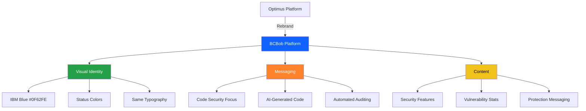

# BCBob Rebranding - Quick Reference

## 🎯 Brand Transformation at a Glance



## 📊 Key Changes Overview

| Element | Before (Optimus) | After (BCBob) |
|---------|------------------|---------------|
| **Brand Name** | Optimus™ | BCBob™ |
| **Primary Color** | Black `#000` | IBM Blue `#0F62FE` |
| **Tagline** | "The platform to create" | "AI that reviews, secures, and defends vibe-coded codebases" |
| **Focus** | General development | Code security & auditing |
| **Target** | All developers | Security-conscious devs |
| **Key Metric** | "98% faster deployment" | "0 vulnerabilities leaked" |
| **Main CTA** | "Start creating" | "Start securing" |

## 🎨 Color Palette

### Primary Brand Color
```
IBM Blue: #0F62FE
```
**Usage**: CTAs, links, brand accents, animated elements

### Status Colors (New)
```
Critical:  #FA4D56 (Red)
High:      #FF832B (Orange)  
Medium:    #F1C21B (Yellow)
Success:   #24A148 (Green)
```
**Usage**: Vulnerability indicators, status badges, security metrics

## 📝 Content Transformation

### Hero Section
```
OLD: "The platform to [create/build/scale/ship]"
NEW: "AI that [reviews/secures/defends/audits] vibe-coded codebases"
```

### Value Proposition
```
OLD: "Your toolkit to stop configuring and start innovating"
NEW: "From unstable prototypes to production-ready software in minutes"
```

### Statistics
```
OLD: "20 days saved on builds" - NETFLIX
NEW: "0 vulnerabilities leaked" - ENTERPRISE

OLD: "98% faster deployment" - STRIPE  
NEW: "100% automated patching" - SECURITY

OLD: "300% throughput increase" - LINEAR
NEW: "3x faster reviews" - WORKFLOW

OLD: "6x faster to ship" - NOTION
NEW: "24/7 continuous auditing" - DEBUG
```

## 🔧 Files to Update

### Phase 1: Core Branding
- ✅ `app/globals.css` - Add IBM Blue and status colors
- ✅ `app/layout.tsx` - Update metadata
- ✅ `components/landing/navigation.tsx` - Update brand name
- ✅ `components/landing/footer-section.tsx` - Update footer

### Phase 2: Content
- ✅ `components/landing/hero-section.tsx` - New messaging
- ✅ `components/landing/features-section.tsx` - Security features
- ✅ `components/landing/metrics-section.tsx` - New statistics
- ✅ `components/landing/pricing-section.tsx` - Security context

### Phase 3: Supporting
- ✅ `components/landing/cta-section.tsx` - Security CTAs
- ✅ `components/landing/how-it-works-section.tsx` - Security process
- ✅ `components/landing/developers-section.tsx` - API/SDK focus
- ✅ `package.json` - Update name and description

## 🎯 Implementation Checklist

- [ ] Add color variables to CSS
- [ ] Update all "Optimus" references to "BCBob"
- [ ] Replace generic platform messaging with security focus
- [ ] Update statistics to security-relevant metrics
- [ ] Change CTAs from "create" to "secure/audit"
- [ ] Update features to focus on vulnerability detection
- [ ] Adjust pricing tiers for security platform
- [ ] Review all content for brand consistency

## 🚀 Ready to Implement

All planning is complete. The rebranding strategy is documented and ready for execution in Code mode.

**Next Step**: Switch to Code mode to implement all changes systematically.
